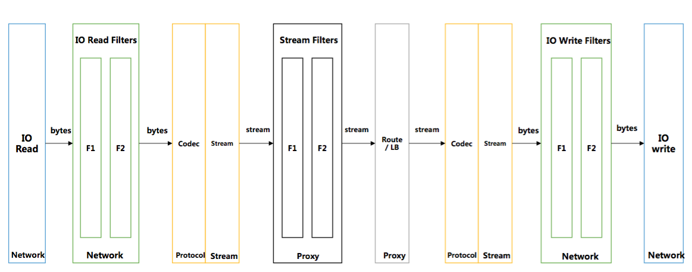
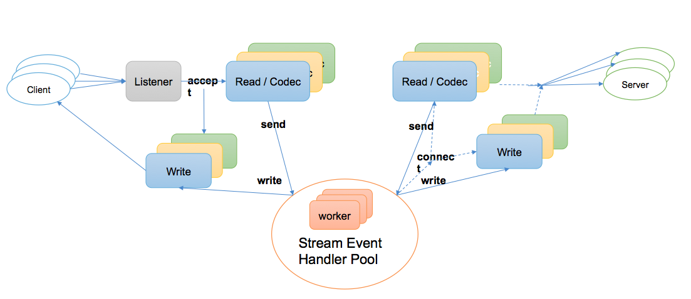
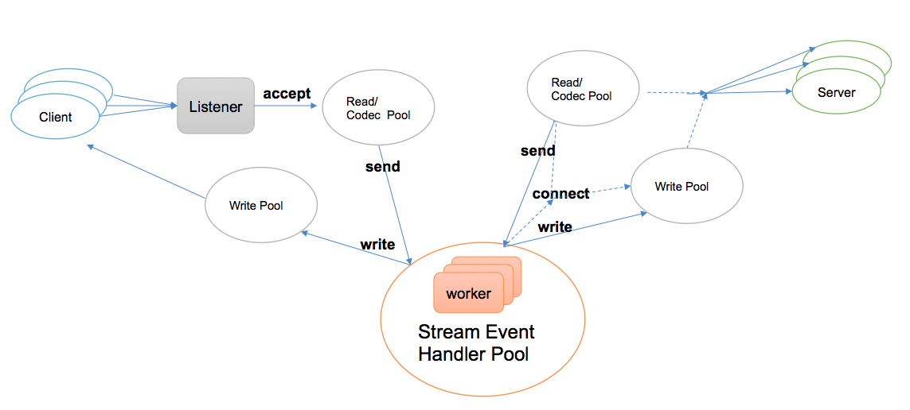

# SOFAMosn Introduction

## SOFAMosn 诞生背景
云原生时代，Service Mesh 作为一个专用的基础设施层，用于提供安全、快速、可靠、智能的服务间通讯，可为微服务的连接、管理和监控带来巨大的便利，从而加速微服务的落地。关于 Service Mesh 的更多介绍，请移步蚂蚁金服大规模微服务架构下的Service Mesh探索之路

作为国内领先的金融服务提供商，蚂蚁金服对系统架构的性能、稳定性、安全性要求较高，且运维架构复杂，为了达到高可用和快速迭代的目的，蚂蚁金服正全面拥抱微服务，云原生， 而 Service Mesh 成为助力蚂蚁 SOFA5，以及兼容 K8S 的容器平台 Sigma等微服务化关键组件落地的重要推手。

在 Service Mesh 落地的方案挑选中， Istio 作为 Service Mesh 的集大成者，无论在功能实现，稳定性，扩展性，以及社区关注度等方面都是不二选择，其数据平面 Envoy 更是具有优秀的设计，可扩展的 XDS API，以及较高的性能等特点，蚂蚁一开始便将 Istio 作为重点的关注对象。

然而，由于 Envoy 使用 C++ 语言开发，不符合蚂蚁技术栈的发展方向且无法兼容现在的运维体系，以及蚂蚁内部有许多业务定制化的诉求，导致我们无法直接使用 Istio。经过调研发现，作为云计算时代主流语言的 Golang 同样具有较高的转发性能，这促使我们考虑开发 golang 版本高性能的 
sidecar 来替换 Envoy 与 Istio 做集成， 因而有了本文要介绍的对象: “SOFAMosn” 

## SOFAMosn 简介
简单来说，SOFAMosn 是一款采用 Golang 开发的 Service Mesh 数据平面代理，由蚂蚁金服系统部网络团队、蚂蚁金服中间件团队、UC 大文娱团队共同开发，功能和定位类似 Envoy，旨在提供分布式，模块化，可观察，智能化的代理能力；她通过模块化，分层解耦的设计，提供了可编程，事件机制，扩展性，高吞吐量的能力。

当前， SOFAMosn 已支持 Envoy 和 Istio 的 API，实现并验证了 Envoy 的常用功能(全量功能在开发中)，通过 XDS API 与 Pilot 对接，SOFAMosn 可获取控制面推送的配置信息，来完成代理的功能。在实践中，你可以使用 SOFAMosn 替代 Envoy 作为转发平面与 Istio 集成来实现 Service Mesh 组件，也可以单独使用 SOFAMosn 
作为业务网关，通过使用 SOFAMosn 你将在如下几个方面获得收益：

1. SOFAMosn 使用 golang 作为开发语言，在云原生时代可以与 k8s 等技术进行无缝对接，可以快速落地微服务，提高开发效率
2. SOFAMosn 可以代理 Java，C++，Go，PHP，Python 等异构语言之间组件的互相调用，目前 SOFAMosn 已经在蚂蚁金服中作为跨语言 RPC 调用的桥梁被使用
3. SOFAMosn 灵活的流量调度能力可以有力的支撑运维体系，包括：蓝绿升级、容灾切换等
4. SOFAMosn 提供TLS、服务鉴权等能力，可满足服务加密与安全的诉求

本文也将从如下几个方面来全面介绍 SOFAMosn 可以带来这些收益的原因
+ 工作原理
+ 架构设计
+ 协程模型
+ 内存使用优化
+ 进程管理
+ 扩展机制

## 工作原理
SOFAMosn 本质是一个 4-7 层代理，所以她可以以独立进程的形式作为 sidecar 与用户程序部署在相同的物理机或者VM中，当然也可以以独立网关的形式单独运行在一台主机或者虚拟机中；
 
以下图为例，MOSN （注: SOFAMosn 有时也简称为 MOSN） 与 Service 部署在同一个 Pod 上，MOSN 监听在固定的端口，一个正向的请求链路包括如下步骤：

+ ServiceA 作为客户端可使用任意语言实现，可使用目前支持的任意的协议类型，比如HTTP1.x，HTTP2.0，SOFARPC 等，将 sub/pub、request 信息等发送给MOSN
+ MOSN 可代理 ServiceA 的服务发现，路由，负载均衡等能力，通过协议转换，转发 ServiceA 的请求信息到上游的 MOSN
+ 上游 MOSN 将接收到的请求通过协议转换，发送到代理的 ServiceB 上 

反向链路类似。通过上述的代理流程，MOSN 代理了 Service A 与 Service B 之间的请求。

这里有一些需要注意的是：
1. 你可以使用 MOSN 只代理 Client 的请求，MOSN 可以直接访问 Server，链路：Client -> MOSN -> Server，反之亦然
2. MOSN 上下游协议可配置为当前支持的协议中的任意一种

## 架构设计
模块化，分层解耦是 SOFAMosn 架构设计的整体原则，以实现可扩展、插件化的开发原则。

### 组成模块
SOFAMosn 由如下的模块组成

+ `Starter` 用于启动 MOSN，包括从配置文件或者以 XDS 模式启动，其中`Config` 用于配置文件的解析等，`XDS` 用于和 Istio 交互，获取 Pilot 推送的配置等
+ `Server` 是 MOSN 运行时的抽象，它以 MOSN 监听的 `Listener` 为维度，对一个 Listener 下生成的 `Proxy`, `Connections` 等进行管理
+ `Hardware` 为 MOSN 后期规划的包括使用加速卡来做 TLS 加速以及 DPDK 来做协议栈加速的一些硬件技术手段
+ Router 为 MOSN 的核心路由模块，支持的功能包括：
    + VirtualHost 形式的路由表
    + 基于 weight 的 cluster 挑选
    + 基于 subset 的子集群路由匹配
    + 路由重试以及重定向功能
+ Upstream 为后端管理模块，支持的功能包括：
    + Cluster 动态更新，添加以及删除等
    + Host动态更新，添加以及删除等
    + 对 Cluster 的 主动/被动 健康检查
    + 熔断机制
+ LoadBalance 为负载均衡模块，当前实现的功能包括：
    + 基本的负载均衡算法: Random, RR, WRR, SWRR 等
    + 高阶的负载均衡算法 subset loadbalancer 等
    + 此模块后期将支持更多的算法
+ Metrics 模块可对协议层的数据做记录和追踪，包括：
    + 对 mosn 向 upstream 转发的请求数目做统计，包括成功的，不成功的
    + 对 mosn 接收 downstream 连接数做统计
    + 对 mosn 转发的数据量做统计等
+ Mixer 用于对请求做服务鉴权等，为开发中模块
+ FlowControl 用来对后端做流控，为开发中模块
+ lab 和 Admin 模块为待开发模块

### 分层设计
在分层上，SOFAMosn 将整体功能分为 "网络 IO 层"，"二进制协议处理层"，"协议流程处理层"以及"转发路由处理层" 四层进行设计，每一层
实现功能的内聚可完成独立的功能，层与层之间相互配合做完整的 proxy 转发。

如下图所示：MOSN 对数据流做代理处理的时候，在入方向数据依次经过网络 IO 层(NET/IO)，
二进制协议处理层(Protocol)，协议流程处理层(Streaming)，转发路由处理层(Proxy)；出向与入向过程基本相反，

下面我们具体介绍每一层的功能和对应的特性：

+ NET/IO 层提供了 IO 读写的封装以及可扩展的 IO 事件订阅机制，具有下面的一些设计特性:
    + 屏蔽IO处理细节
    + 自定义网络链接生命周期的管理
    + 可编程的网络模型，核心方法，监控指标
    + 可扩展的插件机制
    + 适用于client/server端的能力
    + 基于golang net包实现
+ PROTOCOL 层提供了根据不同协议对数据进行序列化/反序列化的处理能力，具有如下的一些设计特性:
    + 定义了编解码核心数据结构
      + 三段式：Headers + Data + Trailers
    + 使用统一的 编/解码器核心接口
    + 提供通用的编/解码引擎
      + 编码：对业务数据进行编码并根据控制指令发送数据
      + 解码：对IO数据进行解码并通过扩展机制通知订阅方
+ STREAM 层提供向上的协议一致性，负责 STREAM 生命周期，管理 Client / Server 模式的请求流行为，对 Client 端stream 提供池化机制等，具有如下一些设计特性：
    + 定义STREAM层编/解码核心接口，提供可扩展的插件机制
      + 不同协议根据自身协议流程封装STREAM细节
    + 支持多种通信模型，包括：PING-PONG，PIPELINE，分帧STREAM三种典型流程特征

+ Proxy 层提供路由选择，负载均衡等的能力，做数据流之间的转发，具有如下的一些设计特性：
    + 可扩展性，提供上下游可配置的多协议转发能力
    + 具备负载均衡，健康检查，熔断等后端管理能力，云端部亲和性
    + Metrics 能力，可统计上下游的路由转发指标

下面是打开后的数据流转示意图
+ MOSN 在 IO 层读取数据，通过 read filter 将数据发送到 Protocol 层进行 Decode
+ Decode 出来的数据，根据不同的协议，回调到 stream 层，进行 stream 的创建和封装
+ stream 创建完毕后，会回调到 Proxy 层做路由和转发，Proxy 层会关联上下游间的转发关系
+ Proxy 挑选到后端后，会根据后端使用的协议，将数据发送到对应协议的 Protocol 层，对数据重新做 Encode
+ Encode 后的数据会发经过 write filter 并最终使用 IO 的 write 发送出去

## 协程模型
当前 MOSN 支持如下两种线程模型，可通过 MOSN 开关进行切换，每种线程模型都有自己适用的场景

### 模型一
如下图所示，使用 golang 默认的 epoll 机制，对每个连接分配独立的读写协程进行阻塞读写操作， proxy层做转发时，使用常驻 worker 协程池负责处理 Stream Event
  
+ 此模型在IO上使用 golang 的调度机制，适用于连接数较少等场景，例如：mosn 作为 sidecar、与 client 同机部署的场景

### 模型二
如下图所示，基于[Netoll](https://godoc.org/github.com/mailru/easygo/netpoll)重写 epoll 机制，将 IO 和 PROXY 均进行池化，downstream connection将自身的读写事件注册到netpoll的epoll/kqueue wait协程，
poll/kqueue wait协程接受到可读事件，触发回调，从协程池中挑选一个执行读操作

+ 使用自定义 Netpoll IO 池化操作带来的好处是：
    + 当可读事件触发时，从协程池中获取一个goroutine来执行读处理，而不是新分配一个goroutine，以此来控制高并发下的协程数量
    + 当收到链接可读事件时，才真正为其分配read buffer以及相应的执行协程。这GetBytes()样可以优化大量空闲链接场景导致的额外协程和read buffer开销
+ 此模型适用于连接数较多，可读的连接数有限，例如：mosn 作为 api gateway 的场景

## 内存使用优化
Golang 相比于 C++，在内存使用效率上依赖于GC，为了提高 Golang 的内存使用率，MOSN 做了如下的尝试来减少内存的使用，优化 GC 的效率
+ 通过自定义的内存复用接口实现了通用的内存复用框架，可实现自定义内存的复用
+ 通过优化 []byte 的获取和回收，进一步优化全局内存的使用
+ 通过优化 socket 的读写循环以及事件触发机制，减小空闲连接对内存分配的使用，进一步减少内存使用
+ 使用 writev 替代 write, 减少内存分配和拷贝，减少锁力度

## 进程管理
MOSN 除了经典的传递 listener fd 加协议层等待方式意外，还支持对存量链接进行协议无关的迁移来实现平滑升级，平滑 reload 等功能
### 连接迁移简介
连接迁移的步骤如下图所示

+ mosn 通过forkexec生成New mosn
+ mosn 通过domain  socket把TCP fd和请求数据发送给New mosn
+ New  mosn转发请求到后端(PUB2)
+ 后端 回复响应到 New mosn
+ New mosn通过mosn传递来的TCP fd，回复响应到client

此后：

+ mosn退出 readloop， 不再接受该TCP连接上的数据
+ New mosn开始 readloop，接受该TCP连接上的数据

## 扩展机制
+ 支持 协议扩展
    MOSN 通过使用同一的编解码引擎以及编/解码器核心接口，提供协议的 plugin 机制，包括支持
    + SofaRPC
    + http1, http2
    + dubbo

    等协议，后面还会支持更多的协议
  
+ 支持 NetworkFilter 扩展
    MOSN 通过提供 network filter 注册机制以及统一的 packet read/write filter 接口，实现了Network filter 扩展机制，当前支持：
    + tcp proxy
    + layer-7 proxy
    + Fault injection 
    
+ 支持 StreamFilter 扩展
    MOSN 通过提供 stream filter 注册机制以及统一的 stream send/receive filter 接口，实现了 Stream filter 扩展机制，包括支持：
    + 支持配置健康检查等
    + 支持故障注入功能

##  

## 历史版本
+ 0.1.0
+ [0.2.0](features/0.2.0/README.md)  

## 开发团队
+ 蚂蚁金服系统部网络团队
+ 蚂蚁金服中间件团队
+ UC 大文娱团队

## 获取相关帮助
* [社区](https://github.com/alipay/mosn/issues)
