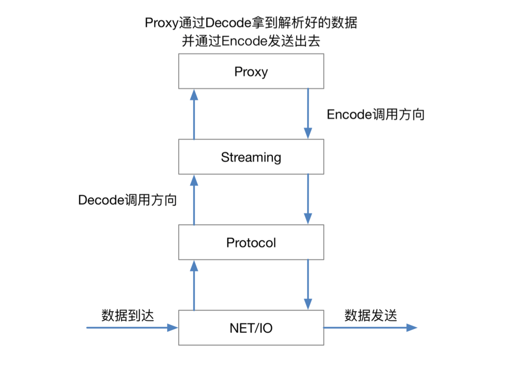
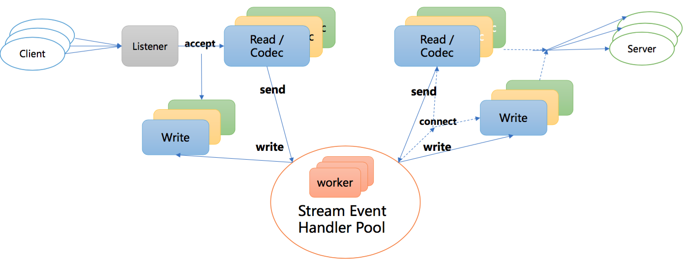
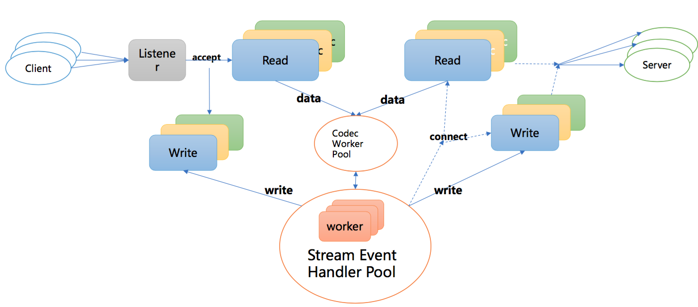
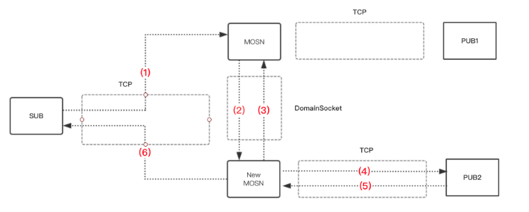

# MOSN Introduction

## MOSN 简介
MOSN 是一款采用 Golang 开发的Service Mesh数据平面代理，功能和定位类似Envoy，旨在提供分布式，模块化，可观察，智能化的代理能力。
其中，模块化，分层解耦是 SOFAMosn 设计的初衷，可编程性，事件机制，扩展性，高吞吐量等是设计中重要考量的因素。
当前， MOSN 已支持Envoy和Istio的API，可使用 MOSN 替代 Envoy 作为转发平面与 Istio 集成来实现 Service Mesh 组件，同时你也可以单独使用 MOSN 作为
业务网关。通过使用 MOSN 你将获得如下收益：

1. MOSN 使用 golang 作为开发语言，在云原生时代可以与 k8s 等技术进行无缝对接，可以快速落地微服务，提高开发效率
2. MOSN 可以代理 Java，C++，Go，PHP，Python 等异构语言之间组件的互相调用，目前 MOSN 已经在蚂蚁金服中作为跨语言 RPC 调用的桥梁被使用
3. MOSN 灵活的流量调度能力可以有力的支撑运维体系，包括：蓝绿升级、容灾切换等
4. MOSN 提供TLS、服务鉴权等能力，可满足服务加密与安全的诉求

本文也将从如下几个方面来全面介绍 MOSN 可以带来这些收益的原因
+ MOSN 工作原理
+ MOSN 架构设计
+ MOSN 构成模块
+ MOSN 协程模型
+ MOSN 进程管理
+ MOSN 扩展机制

## MOSN 工作原理
+ 如下图所示为 MOSN 以 sidecar 模式与服务部署在同一个 Pod 上，通过协议之间的转换，代理 Service 之间请求的工作原理图，一个正向的请求包含如下过程：
1. Service A 通过发送 HTTP/SOFARPC 请求到本地 MOSN
2. 本地 MOSN 将请求封装成 HTTP2 协议，转发给上游的 MOSN
3. 上游 MOSN 收到请求后，将 HTTP2 协议代理到后端 Service B上进行处理

反向链路类似。

+ 同时，MOSN 上下游之间允许配置使用的协议，当前支持的协议包括 HTTP1.x, HTTP2.0, SOFARPC, Dubbo 等
未来还将支持更多的协议

## MOSN 架构设计
MOSN 在架构设计上，为了实现可扩展，易维护等特点，将整体功能分为 "网络 IO 层"，"二进制协议处理层"，"协议流程处理层"以及"转发路由处理层" 四层进行设计，每一层
实现功能的内聚可完成独立的功能，层与层之间相互配合做完整的 proxy 转发。

如下图所示：MOSN 对数据流做代理处理的时候，在入方向数据依次经过网络 IO 层(NET/IO)，
二进制协议处理层(Protocol)，协议流程处理层(Streaming)，转发路由处理层(Proxy)；出向与入向过程基本相反，

下面我们具体介绍每一层的功能和对应的特性：

+ NET/IO 层提供了 IO 读写的封装以及可扩展的 IO 事件订阅机制，具有下面的一些设计特性:
    + 屏蔽IO处理细节
    + 自定义网络链接生命周期的管理
    + 可编程的网络模型，核心方法，监控指标
    + 可扩展的插件机制
    + 适用于client/server端的能力
    + 基于golang net包实现
+ PROTOCOL 层提供了根据不同协议对数据进行序列化/反序列化的处理能力，具有如下的一些设计特性:
    + 定义了编解码核心数据结构
      + 三段式：Headers + Data + Trailers
    + 使用统一的 编/解码器核心接口
    + 提供通用的编/解码引擎
      + 编码：对业务数据进行编码并根据控制指令发送数据
      + 解码：对IO数据进行解码并通过扩展机制通知订阅方
+ STREAM 层提供向上的协议一致性，负责 STREAM 生命周期，管理 Client / Server 模式的请求流行为，对 Client 端stream 提供池化机制等，具有如下一些设计特性：
    + 定义STREAM层编/解码核心接口，提供可扩展的插件机制
      + 不同协议根据自身协议流程封装STREAM细节
    + 支持多种通信模型，包括：PING-PONG，PIPELINE，分帧STREAM三种典型流程特征

+ Proxy 层提供路由选择，负载均衡等的能力，做数据流之间的转发，具有如下的一些设计特性：
    + 可扩展性，提供上下游可配置的多协议转发能力
    + 具备负载均衡，健康检查，熔断等后端管理能力，云端部亲和性
    + Metrics 能力，可统计上下游的路由转发指标

## MOSN 组成模块
MOSN 由如下的模块组成

+ `Starter` 用于启动 MOSN，包括从配置文件或者以 XDS 模式启动，其中`Config` 用于配置文件的解析等，`XDS` 用于和 Istio 交互，获取 Pilot 推送的配置等
+ `Server` 是 MOSN 运行时的抽象，它以 MOSN 监听的 `Listener` 为维度，对一个 Listener 下生成的 `Proxy`, `Connections` 等进行管理
+ `Hardware` 为 MOSN 后期规划的包括使用加速卡来做 TLS 加速以及 DPDK 来做协议栈加速的一些硬件技术手段
+ 如上述所说， `NET/IO`，`Protocl`， `Stream`, `Proxy` 为 MOSN 的核心模块，用来完成整个转发功能，这里不再赘述
+ Router 为 MOSN 的核心路由模块，支持的功能包括：
    + VirtualHost 形式的路由表
    + 基于 weight 的 cluster 挑选
    + 基于 subset 的子集群路由匹配
    + 路由重试以及重定向功能
+ Upstream 为后端管理模块，支持的功能包括：
    + Cluster 动态更新，添加以及删除等
    + Host动态更新，添加以及删除等
    + 对 Cluster 的 主动/被动 健康检查
    + 熔断机制
+ LoadBalance 为负载均衡模块，当前实现的功能包括：
    + 基本的负载均衡算法: Random, RR, WRR, SWRR 等
    + 高阶的负载均衡算法 subset loadbalancer 等
    + 此模块后期将支持更多的算法
+ Metrics 模块可对协议层的数据做记录和追踪，包括：
    + 对 mosn 向 upstream 转发的请求数目做统计，包括成功的，不成功的
    + 对 mosn 接收 downstream 连接数做统计
    + 对 mosn 转发的数据量做统计等
+ Mixer 用于对请求做服务鉴权等，为开发中模块
+ FlowControl 用来对后端做流控，为开发中模块
+ lab 和 Admin 模块为待开发模块

## MOSN 协程模型
当前 MOSN 支持如下两种线程模型，可通过 MOSN 开关进行切换，每种线程模型都有自己适用的场景

### 模型一
如下图所示，使用 golang 默认的 epoll 机制，对每个连接分配独立的读写协程进行阻塞读写操作， proxy层做转发时，使用常驻 worker 协程池负责处理 Stream Event
  
+ 此模型在IO上使用 golang 的调度机制，适用于连接数较少等场景，例如：mosn 作为 sidecar、与 client 同机部署的场景

### 模型二
如下图所示，基于[Netoll](https://godoc.org/github.com/mailru/easygo/netpoll)重写 epoll 机制，将 IO 和 PROXY 均进行池化，downstream connection将自身的读写事件注册到netpoll的epoll/kqueue wait协程，
poll/kqueue wait协程接受到可读事件，触发回调，从协程池中挑选一个执行读操作

+ 使用自定义 Netpoll IO 池化操作带来的好处是：
    + 当可读事件触发时，从协程池中获取一个goroutine来执行读处理，而不是新分配一个goroutine，以此来控制高并发下的协程数量
    + 当收到链接可读事件时，才真正为其分配read buffer以及相应的执行协程。这样可以优化大量空闲链接场景导致的额外协程和read buffer开销
+ 此模型适用于连接数较多，可读的连接数有限，例如：mosn 作为 api gateway 的场景

## MOSN 进程管理
MOSN 除了经典的传递 listener fd 加协议层等待方式意外，还支持对存量链接进行协议无关的迁移来实现平滑升级，平滑 reload 等功能
### MOSN 连接迁移简介
连接迁移的步骤如下图所示

+ mosn 通过forkexec生成New mosn
+ mosn 通过domain  socket把TCP fd和请求数据发送给New mosn
+ New  mosn转发请求到后端(PUB2)
+ 后端 回复响应到 New mosn
+ New mosn通过mosn传递来的TCP fd，回复响应到client

此后：

+ mosn退出  readloop， 不再接受该TCP连接上的数据
+ New mosn开始 readloop，接受该TCP连接上的数据

## MOSN 扩展机制
+ 支持 协议扩展

    MOSN 通过使用同一的编解码引擎以及编/解码器核心接口，提供协议的 plugin 机制，包括支持
    + SofaRPC
    + http1, http2
    + dubbo

    等协议，后面还会支持更多的协议
  
+ 支持 NetworkFilter 扩展

    MOSN 通过提供 network filter 注册机制以及统一的 packet read/write filter 接口，实现了Network filter 扩展机制，当前支持：
    + tcp proxy
    + layer-7 proxy
    + Fault injection 
    
+ 支持 StreamFilter 扩展

    MOSN 通过提供 stream filter 注册机制以及统一的 stream send/receive filter 接口，实现了 Stream filter 扩展机制，包括支持：
    + 支持配置健康检查等
    + 支持故障注入功能

## MOSN 历史版本
+ 0.1.0
+ [0.2.0](features/0.2.0/README.md)  

## MOSN 开发团队
+ 蚂蚁金服系统部网络团队
+ 蚂蚁金服中间件团队
+ UC 大文娱团队

## MOSN 系列文章编写团队以及文章认领
在后序的文章中，我们还将详细介 Network/IO、Protocol、Stream、Proxy 层每一块的实现机制

## 获取相关帮助
* [社区](https://github.com/alipay/mosn/issues)
