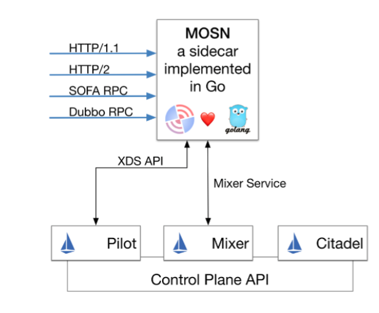

## 一、SOFA-Mesh 的结构

SOFA-Mesh 基于 [Istio](https://istio.io) 上定制，将其数据平面（Data Panel）从 Envoy 替换为蚂蚁自研的 [SOFA-Mosn](https://github.com/alipay/sofa-mosn)，下面是一张 SOFA-Mesh 各部件的关系图

<div align=center></div>

## 二、准备工作

本文以 macOS 为例，其他环境可以参考对应的官方文档

### 1. 安装 hyperkit

先安装 [docker-for-mac](https://store.docker.com/editions/community/docker-ce-desktop-mac)，之后[安装驱动](https://github.com/kubernetes/minikube/blob/master/docs/drivers.md#hyperkit-driver)

#### 1.1 安装 docker 

* 下载软件包安装，或者使用如下的命令安装

```bash
brew cask install docker
```

#### 1.2 安装驱动

```bash
$ curl -LO https://storage.googleapis.com/minikube/releases/latest/docker-machine-driver-hyperkit \
&& chmod +x docker-machine-driver-hyperkit \
&& sudo mv docker-machine-driver-hyperkit /usr/local/bin/ \
&& sudo chown root:wheel /usr/local/bin/docker-machine-driver-hyperkit \
&& sudo chmod u+s /usr/local/bin/docker-machine-driver-hyperkit
```

### 2. 安装 Minikube

推荐使用 Minikube v0.28 以上来体验，请参考 [https://github.com/kubernetes/minikube](https://github.com/kubernetes/minikube)

```bash
$ brew cask install minikube
```

### 3. 启动 Minikube

注意，pilot 至少需要 2G 内存，所以在启动的时候，可以通过加参数的方法给 minikube 添加使用资源


```bash
$ minikube --vm-driver=hyperkit start  // --memory=4096  --cpus=2
```

### 4. 安装 kubectl 命令行工具

kubectl 是用于针对 k8s 集群运行命令的命令行接口，安装参考 [https://kubernetes.io/docs/tasks/tools/install-kubectl/#install-kubectl](https://kubernetes.io/docs/tasks/tools/install-kubectl/#install-kubectl)

```bash
$ brew install kubernetes-cli
```

### 5. 安装 Helm

Helm 是一个 k8s 的包管理工具，安装参考 [https://docs.helm.sh/using\_helm/#installing-helm](https://docs.helm.sh/using_helm/#installing-helm)

```bash
$ brew install kubernetes-helm
```

## 三、源码方式部署 SOFA-Mesh

* ### <a name="l3lqgh"></a>1. 下载 SOFA-Mesh 源码

```bash
$ git clone git@github.com:alipay/sofa-mesh.git
$ cd sofa-mesh
```

* ### <a name="4pzudw"></a>2. 通过 Helm 安装 SOFA-Mesh

```bash
$ kubectl apply -f install/kubernetes/helm/helm-service-account.yaml
$ helm init --service-account tiller
$ helm install install/kubernetes/helm/istio --name istio --namespace istio-system
```

* ### <a name="l7rway"></a>3. 验证安装

```bash
$ kubectl get svc -n istio-system
NAME                       TYPE        CLUSTER-IP       EXTERNAL-IP   PORT(S)                                 AGE
istio-citadel              ClusterIP   172.16.113.0     <none>        8060/TCP,9093/TCP                       2m
istio-egressgateway        ClusterIP   172.16.93.234    <none>        80/TCP,443/TCP                          2m
istio-galley               ClusterIP   172.16.199.113   <none>        443/TCP,9093/TCP                        2m
istio-pilot                ClusterIP   172.16.94.105    <none>        15010/TCP,15011/TCP,8080/TCP,9093/TCP   2m
istio-policy               ClusterIP   172.16.152.158   <none>        9091/TCP,15004/TCP,9093/TCP             2m
istio-sidecar-injector     ClusterIP   172.16.226.86    <none>        443/TCP                                 2m
istio-statsd-prom-bridge   ClusterIP   172.16.18.241    <none>        9102/TCP,9125/UDP                       2m
istio-telemetry            ClusterIP   172.16.200.109   <none>        9091/TCP,15004/TCP,9093/TCP,42422/TCP   2m
prometheus                 ClusterIP   172.16.157.229   <none>        9090/TCP                                2m
```

istio-system 命名空间下的 pod 状态都是 Running 时，说明已经部署成功，注意必须保证所有的都是 Running 状态

```bash
$ kubectl get pods -n istio-system
NAME                                       READY    STATUS   RESTARTS    AGE
istio-citadel-6579c78cd9-w57lr              1/1     Running   0          5m
istio-egressgateway-7649f76df4-zs8kw        1/1     Running   0          5m
istio-galley-c77876cb6-nhczq                1/1     Running   0          5m
istio-ingressgateway-5c9c8565d9-d972t       1/1     Running   0          5m
istio-pilot-7485f9fb4b-xsvtm                0/1     Running   0          5m
istio-policy-5766bc84b9-p2wfj               1/1     Running   0          5m
istio-sidecar-injector-7f5f586bc7-2sdx6     1/1     Running   0          5m
istio-statsd-prom-bridge-7f44bb5ddb-stcf6   1/1     Running   0          5m
istio-telemetry-55ff8c77f4-q8d8q            1/1     Running   0          5m
prometheus-84bd4b9796-nq8lg                 1/1     Running   0          5m
```

## 三、BookInfo 实验

BookInfo 是一个类似豆瓣的图书应用，它包含四个基础服务

* Product Page：主页，由 python 开发，展示所有图书信息，它会调用 Reviews 和 Details 服务
* Reviews：评论，由 java 开发，展示图书评论，会调用 Ratings 服务
* Ratings：评分服务，由 nodejs 开发
* Details：图书详情，由 ruby 开发

<div align=center></div>


### 1. 部署 BookInfo 应用并注入 SOFA-Mosn

> 详细过程可以参考 [https://istio.io/docs/examples/bookinfo/](https://istio.io/docs/examples/bookinfo/)

注入 SOFAMosn
```bash
$ kubectl label namespace default istio-injection=enabled
```
部署 Bookinfo
```bash
$ kubectl apply -f samples/bookinfo/platform/kube/bookinfo.yaml
```

验证部署是否成功

```bash
$ kubectl get services
NAME                       CLUSTER-IP   EXTERNAL-IP   PORT(S)              AGE
details                    10.0.0.31    <none>        9080/TCP             6m
kubernetes                 10.0.0.1     <none>        443/TCP              7d
productpage                10.0.0.120   <none>        9080/TCP             6m
ratings                    10.0.0.15    <none>        9080/TCP             6m
reviews                    10.0.0.170   <none>        9080/TCP             6m
```

等待所有的 pods 等成功运行起来

```bash
$ kubectl get pods
NAME                                        READY     STATUS    RESTARTS   AGE
details-v1-1520924117-48z17                 2/2       Running   0          6m
productpage-v1-560495357-jk1lz              2/2       Running   0          6m
ratings-v1-734492171-rnr5l                  2/2       Running   0          6m
reviews-v1-874083890-f0qf0                  2/2       Running   0          6m
reviews-v2-1343845940-b34q5                 2/2       Running   0          6m
reviews-v3-1813607990-8ch52                 2/2       Running   0          6m
```

### 2. 访问 BookInfo 服务

开启 kubectl 代理
```bash
$ kubectl proxy
Starting to serve on 127.0.0.1:8001
```

访问 [http://127.0.0.1:8001/api/v1/namespaces/default/services/productpage:9080/productpage](http://127.0.0.1:8001/api/v1/namespaces/default/services/productpage:9080/productpage) 正常的话会看到 BookInfo 的界面，刷新几次会发现 reviews 这部分会发生变化（对应 v1，v2，v3 三个版本）

### 3. 验证 Mosn 按 version 路由能力

首先为 BookInfo 的 service 创建一系列的 destination rules
```bash
$ kubectl apply -f samples/bookinfo/networking/destination-rule-all.yaml
```

指定 reviews 服务只访问 v1 版本

```bash
$ kubectl apply -f samples/bookinfo/networking/virtual-service-all-v1.yaml
```

再次访问 [http://127.0.0.1:8001/api/v1/namespaces/default/services/productpage:9080/productpage](http://127.0.0.1:8001/api/v1/namespaces/default/services/productpage:9080/productpage) 发现 reviews 部分不会有「星星」（对应 v1 版本），多刷几次也不会改变

### 4. 验证 Mosn 按 weight 路由能力

我们通过下面操作将 v1 和 v3 版本各分配 50% 的流量
```bash
$ kubectl apply -f samples/bookinfo/networking/virtual-service-reviews-50-v3.yaml
```

再次访问 [http://127.0.0.1:8001/api/v1/namespaces/default/services/productpage:9080/productpage](http://127.0.0.1:8001/api/v1/namespaces/default/services/productpage:9080/productpage) 这次 v1 和 v3 各有 1/2 几率出现

### 5. 验证 Mosn 按照特定 header 路由能力

BookInfo 系统右上角有一个登陆的入口，登陆以后请求会带上 `end-user` 这个自定义，值是 user name，Mosn 支持根据这个 header 的值来做路由。比如，我们尝试将 jason 这个用户路由到 v2 版本，其他的路由到 v1 版本

```bash
$ kubectl apply -f samples/bookinfo/networking/virtual-service-reviews-test-v2.yaml
```

未登陆情况下访问 [http://127.0.0.1:8001/api/v1/namespaces/default/services/productpage:9080/productpage](http://127.0.0.1:8001/api/v1/namespaces/default/services/productpage:9080/productpage) 会看到 v1 版本 reviews (没有星星)

以 jason 身份登陆，会看到 v2 版本（黑色的星星）

以其他身份登陆，任然看看 v1 版本（没有星星）

