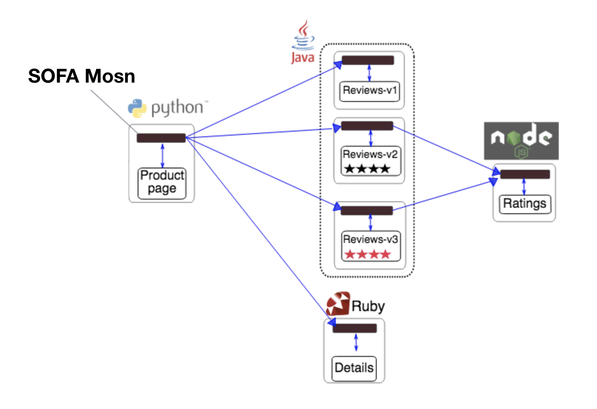
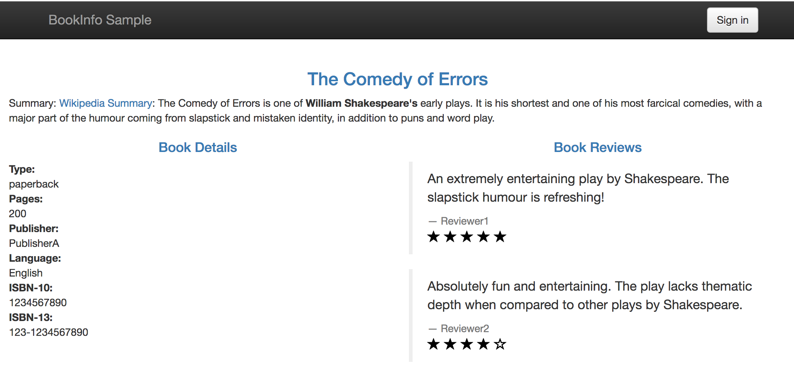

# 使用 SOFAMosn 搭建 Service Mesh 平台

本文将介绍如何使用 SOFAMosn 在 SOFAMesh 框架下搭建 Service Mesh 的开发环境，并验证 SOFAMosn 的一些基础路由能力、负载均衡能力等。本文介绍的内容将包括 : 
+ SOFAMosn 与 SOFAMesh 的关系
+ 准备工作
+ 源码方式部署 SOFAMesh
+ Bookinfo 实验

## SOFAMosn 与 SOFAMesh 的关系

我们曾在 [《SOFAMosn Introduction》](../Introduction.md) 一文中介绍过，SOFAMosn 是一款采用 Golang 开发的 Service Mesh 数据平面代理。而 SOFAMesh 则是基于 Istio
改进和扩展而来的 Service Mesh 大规模落地实践方案，SOFAMosn 作为 SOFAMesh 的关键组件用来完成数据面的转发。
下图是 SOFAMesh 整体框架下，SOFAMosn 的工作示意图。[注：当前 SOFAMosn 不支持在原生的 Istio 中直接使用]
<div align=center></div>

## 准备工作

本文以 macOS 为例 ，其他环境可以安装对应版本的软件。

### 1. 安装 hyperkit

先安装 [docker-for-mac](https://store.docker.com/editions/community/docker-ce-desktop-mac)，之后[安装驱动](https://github.com/kubernetes/minikube/blob/master/docs/drivers.md#hyperkit-driver)

#### 1.1 安装 docker 

* 下载软件包安装，或者使用如下的命令安装
```bash
$ brew cask install docker
```

#### 1.2 安装驱动

```bash
$ curl -LO https://storage.googleapis.com/minikube/releases/latest/docker-machine-driver-hyperkit \
&& chmod +x docker-machine-driver-hyperkit \
&& sudo mv docker-machine-driver-hyperkit /usr/local/bin/ \
&& sudo chown root:wheel /usr/local/bin/docker-machine-driver-hyperkit \
&& sudo chmod u+s /usr/local/bin/docker-machine-driver-hyperkit
```

### 2. 安装 Minikube(也可以购买商业 k8s 集群)

推荐使用 Minikube v0.28 以上来体验，请参考 [https://github.com/kubernetes/minikube](https://github.com/kubernetes/minikube)

```bash
$ brew cask install minikube
```

### 3. 启动 Minikube

注意，pilot 至少需要 2G 内存，所以在启动的时候，可以通过加参数的方法给 minikube 添加分配的资源，如果你机器的资源不够，推荐使用商业版本的 k8s 集群。

```bash
$ minikube start --memory=8192 --cpus=4 --kubernetes-version=v1.10.0 --vm-driver=hyperkit
```

### 4. 安装 kubectl 命令行工具

kubectl 是用于针对 k8s 集群运行命令的命令行接口，安装参考 [https://kubernetes.io/docs/tasks/tools/install-kubectl/#install-kubectl](https://kubernetes.io/docs/tasks/tools/install-kubectl/#install-kubectl)

```bash
$ brew install kubernetes-cli
```

### 5. 安装 Helm

Helm 是一个 k8s 的包管理工具，安装参考 [https://docs.helm.sh/using\_helm/#installing-helm](https://docs.helm.sh/using_helm/#installing-helm)

```bash
$ brew install kubernetes-helm
```

## 源码方式部署 SOFAMesh

### 1. 下载 SOFAMesh 源码

```bash
$ git clone git@github.com:alipay/sofa-mesh.git
$ cd sofa-mesh
```

### 2. 通过 Helm 安装 SOFAMesh

使用 Helm 安装之前，需要先查看 Helm 的版本

```bash
$ helm version
```

如果版本在 2.10 之前，需要手动 安装 istio 的 CRD，否则不需要。(在笔者写此文的时候，安装的 helm 已经是v2.11.0，所以下面的步骤可以直接跳过)

```bash
$ kubectl apply -f install/kubernetes/helm/istio/templates/crds.yaml
$ kubectl apply -f install/kubernetes/helm/istio/charts/certmanager/templates/crds.yaml
```

之后 使用 Helm 安装 ISTIO 有两种方式，这里推荐使用第一种，如果第一种不 work，可以尝试第二种

   + 方式一：使用  `helm template` 安装
   
    $ helm template install/kubernetes/helm/istio --name istio --namespace istio-system > $HOME/istio.yaml
    $ kubectl create namespace istio-system
    $ kubectl apply -f $HOME/istio.yaml

   + 如果安装成功后，需要卸载的话：
    
    $ kubectl delete -f $HOME/istio.yaml
    
   + 方式二：使用  `helm install 安装`

    $ kubectl apply -f install/kubernetes/helm/helm-service-account.yaml
    $ helm init --service-account tiller
    $ helm install install/kubernetes/helm/istio --name istio --namespace istio-system

   + 如果安装成功后，需要卸载的话：
   
    $ helm delete --purge istio

### 3. 验证安装

```bash
$ kubectl get svc -n istio-system
NAME                       TYPE        CLUSTER-IP       EXTERNAL-IP   PORT(S)                                 AGE
istio-citadel              ClusterIP   172.16.113.0     <none>        8060/TCP,9093/TCP                       2m
istio-egressgateway        ClusterIP   172.16.93.234    <none>        80/TCP,443/TCP                          2m
istio-galley               ClusterIP   172.16.199.113   <none>        443/TCP,9093/TCP                        2m
istio-pilot                ClusterIP   172.16.94.105    <none>        15010/TCP,15011/TCP,8080/TCP,9093/TCP   2m
istio-policy               ClusterIP   172.16.152.158   <none>        9091/TCP,15004/TCP,9093/TCP             2m
istio-sidecar-injector     ClusterIP   172.16.226.86    <none>        443/TCP                                 2m
istio-statsd-prom-bridge   ClusterIP   172.16.18.241    <none>        9102/TCP,9125/UDP                       2m
istio-telemetry            ClusterIP   172.16.200.109   <none>        9091/TCP,15004/TCP,9093/TCP,42422/TCP   2m
prometheus                 ClusterIP   172.16.157.229   <none>        9090/TCP                                2m
```

istio-system 命名空间下的 pod 状态都是 Running 时，说明已经部署成功

```bash
$ kubectl get pods -n istio-system
NAME                                       READY    STATUS   RESTARTS    AGE
istio-citadel-6579c78cd9-w57lr              1/1     Running   0          5m
istio-egressgateway-7649f76df4-zs8kw        1/1     Running   0          5m
istio-galley-c77876cb6-nhczq                1/1     Running   0          5m
istio-ingressgateway-5c9c8565d9-d972t       1/1     Running   0          5m
istio-pilot-7485f9fb4b-xsvtm                1/1     Running   0          5m
istio-policy-5766bc84b9-p2wfj               1/1     Running   0          5m
istio-sidecar-injector-7f5f586bc7-2sdx6     1/1     Running   0          5m
istio-statsd-prom-bridge-7f44bb5ddb-stcf6   1/1     Running   0          5m
istio-telemetry-55ff8c77f4-q8d8q            1/1     Running   0          5m
prometheus-84bd4b9796-nq8lg                 1/1     Running   0          5m
```

## 三、BookInfo 实验

BookInfo 是一个类似豆瓣的图书应用，它包含四个基础服务

* Product Page：主页，由 python 开发，展示所有图书信息，它会调用 Reviews 和 Details 服务
* Reviews：评论，由 java 开发，展示图书评论，会调用 Ratings 服务
* Ratings：评分服务，由 nodejs 开发
* Details：图书详情，由 ruby 开发

<div align=center></div>


### 1. 部署 BookInfo 应用并注入 SOFA-Mosn

> 详细过程可以参考 [https://istio.io/docs/examples/bookinfo/](https://istio.io/docs/examples/bookinfo/)

+ 注入 SOFAMosn

```bash
$ kubectl label namespace default istio-injection=enabled
```
+ 部署 Bookinfo

```bash
$ kubectl apply -f samples/bookinfo/platform/kube/bookinfo.yaml
```

+ 验证部署是否成功

```bash
$ kubectl get services
NAME                       CLUSTER-IP   EXTERNAL-IP   PORT(S)              AGE
details                    10.0.0.31    <none>        9080/TCP             6m
kubernetes                 10.0.0.1     <none>        443/TCP              7d
productpage                10.0.0.120   <none>        9080/TCP             6m
ratings                    10.0.0.15    <none>        9080/TCP             6m
reviews                    10.0.0.170   <none>        9080/TCP             6m
```

+ 等待所有的 pods 等成功运行起来

```bash
$ kubectl get pods
NAME                                        READY     STATUS    RESTARTS   AGE
details-v1-1520924117-48z17                 2/2       Running   0          6m
productpage-v1-560495357-jk1lz              2/2       Running   0          6m
ratings-v1-734492171-rnr5l                  2/2       Running   0          6m
reviews-v1-874083890-f0qf0                  2/2       Running   0          6m
reviews-v2-1343845940-b34q5                 2/2       Running   0          6m
reviews-v3-1813607990-8ch52                 2/2       Running   0          6m
```

### 2. 访问 BookInfo 服务

* 开启 gateway 模式
```powershell
$ kubectl apply -f samples/bookinfo/networking/bookinfo-gateway.yaml
$ kubectl get gateway        // 查看 gateway 是否运行起来
NAME               AGE
bookinfo-gateway   24m
```

* 查看 EXTERNAL-IP 是否存在
```powershell
$ kubectl get svc istio-ingressgateway -n istio-system
NAME                   TYPE           CLUSTER-IP     EXTERNAL-IP      PORT(S)                                                                                                     AGE
istio-ingressgateway   LoadBalancer   172.19.8.162   161.117.70.217   80:31380/TCP,443:31390/TCP,31400:31400/TCP,15011:32393/TCP,8060:30940/TCP,15030:31601/TCP,15031:31392/TCP   48m
```

* 设置 ingress IP 与 ports
```powershell
$ export INGRESS_HOST=$(kubectl -n istio-system get service istio-ingressgateway -o jsonpath='{.status.loadBalancer.ingress[0].ip}')
$ export INGRESS_PORT=$(kubectl -n istio-system get service istio-ingressgateway -o jsonpath='{.spec.ports[?(@.name=="http2")].port}')
$ export SECURE_INGRESS_PORT=$(kubectl -n istio-system get service istio-ingressgateway -o jsonpath='{.spec.ports[?(@.name=="https")].port}')
```

* 设置 gateway 地址
```powershell
$ export GATEWAY_URL=$INGRESS_HOST:$INGRESS_PORT
$ echo $GATEWAY_URL   //例如我这里的地址是 161.117.70.217:80
161.117.70.217:80
```

* 验证 gateway 是否生效
```
$ curl -o /dev/null -s -w "%{http_code}\n"  http://$GATEWAY_URL/productpage   //输出 200 表示成功 
200
``` 

* 观察页面情况

访问 http://$GATEWAY_URL/productpage (注意： $GATEWAY_URL 需要替换成你设置的地址)，正常的话通过刷新会看到如下所示 BookInfo 的界面，其中 Book Reviews 有三个版本，
刷新后依次会看到(可以查看 samples/bookinfo/platform/kube/bookinfo.yaml 中的配置发现为什么是这三个版本)

+ 版本一 的界面


+ 版本二 的界面


+ 版本三 的界面


### 3. 验证 MOSN 按 version 路由能力

+ 首先为 BookInfo 的 service 创建一系列的 destination rules

```bash
$ kubectl apply -f samples/bookinfo/networking/destination-rule-all.yaml
```

+ 指定 reviews 服务只访问 v1 版本

```bash
$ kubectl apply -f samples/bookinfo/networking/virtual-service-all-v1.yaml
```

访问 http://$GATEWAY_URL/productpage 发现 reviews 固定在如下版本一的页面不再变化


### 4. 验证 MOSN 按 weight 路由能力

+ 我们通过下面操作将 v1 和 v3 版本各分配 50% 的流量
```bash
$ kubectl apply -f samples/bookinfo/networking/virtual-service-reviews-50-v3.yaml
```

访问 http://$GATEWAY_URL/productpage 这次 v1 和 v3 各有 1/2 几率出现

### 5. 验证 MOSN 按照特定 header 路由能力

+ BookInfo 系统右上角有一个登陆的入口，登陆以后请求会带上 end-user 这个自定义，值是 user name，Mosn 支持根据这个 header 的值来做路由。比如，我们尝试将 jason 这个用户路由到 v2 版本，
其他的路由到 v1 版本 (用户名和密码均是：jason，为什么是这个用户可以查看对应的 yaml 文件)
```bash
$ kubectl apply -f samples/bookinfo/networking/virtual-service-reviews-test-v2.yaml
```
访问 http://$GATEWAY_URL/productpage 时：

+ 以 jason 身份登陆，会看到 v2 版本


+ 以其他身份登录，始终在 v1 版本

