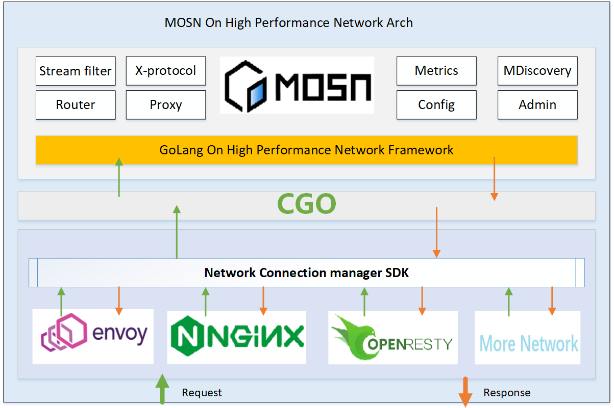

# 介绍

MOSN 在 Service Mesh 领域作为东西向 RPC 服务治理网络转发组件已经在社区很多公司都得到了一定实践，为了进一步节省研发运维等相关成本，目前业界也有很多公司在考虑统一东西、南北向数据转发面为一个。MOSN 在作为东西 Sidecar 场景当前性能足以，但在作为南北向网关会有一定性能上限（比如单机百万级长连接场景、高并发等）。为了解决上述问题，我们在 MOSN 的 Network 层做一个高性能的网络扩展层，使其可以和高性能网络库结合使用（如Nginx、Envoy、OpenResty 等），使其底层网络具备高性能处理的同时，又能复用 MOSN Stream Filter 等能力。MOSN 通过扩展一个标准的 GOHPNF(Golang On High Performance Network Framework) 适配层和底层的高性能网络组件（如 Nginx、Envoy、Openresty 等）生态打通。使得其底层网络具备 C 同等的处理能力的同时，又能使上层业务可高效复用 MOSN 的处理能力及 GoLang 的高开发效率。




如上图所示，MOSN 通过扩展一个标准的 GOHPNF(Golang On High Performance Network Framework) 适配层和底层的高性能网络组件（如 Nginx、Envoy、Openresty 等）生态打通。使得其底层网络具备 C 同等的处理能力的同时，又能使上层业务可高效复用 MOSN 的处理能力及 GoLang 的高开发效率。

# 编译

* 编译 MOSN 以及 L7 网络扩展

执行如下命令后，会在当前路径生成 `output` 目录，该目录里面会产生两个文件 `golang_extention.so` 和 `golang_extention.h`。其中  `golang_extention.so` 是用于 MOSN 和 L7 高性能网络扩展的通信层, `golang_extention.h` 文件是提供了和 MOSN L7 场景下通信的函数声明。 

```
make build-l7
```

* 使用 Envoy 作为 MOSN 的 L7 网络扩展，并构建其 image

执行如下命令后，将会使用 `build/image/envoy` 来集成 MOSN L7 网络扩展 `golang_extention` ,编译完后将会在本地生成一个名称为 `mosn` 的 image，之后就可以启动该 image 。

```
make build-moe-image
```


# 使用事例

如下事例是通过把 MOSN 的底层网络配置为 Envoy 扩展后，通过在 MOSN 侧使用 GoLang 语言开发一个 stream filter 就可以实现 Envoy 的动态路由能力：

根据用户请求 header 的 uid 字段做路由，比如将 uid 范围在 [1,100] 的请求路由到应用的 s1 站点，将 uid 范围在 [101, 200] 的请求路由到 s2 站点，将其它范围 uid 请求路由到 s3 站点, 如果没有 uid 则将轮训转发到 s1、s2、s3。

注：在该事例中我们选择的是 Envoy 作为 MOSN 的 network 扩展，当然也是可以选择其它高性能网关作为 MOSN 的网络层扩展插件（如：Nginx）。

#### 步骤 1 (mosn filter 开发)

关于动态路由，已经在 MOSN 里开发了 `metadata` 模块，所以只需要在其 `metadata` 模块下扩展自己的路由实现即可。本事例我们扩展只需在该模块下扩展一个 `unit` 模块即可： 

进入 mosn/pkg/networkextention/l7/stream/filter/metadata/ ，新建 `unit/unit.go` 增加如下内容即可（只需要 70 行 Golang 就可以实现上述功能）：

```
$cat  mosn/pkg/networkextention/l7/stream/filter/metadata/unit/unit.go

/*
 * Licensed to the Apache Software Foundation (ASF) under one or more
 * contributor license agreements.  See the NOTICE file distributed with
 * this work for additional information regarding copyright ownership.
 * The ASF licenses this file to You under the Apache License, Version 2.0
 * (the "License"); you may not use this file except in compliance with
 * the License.  You may obtain a copy of the License at
 *
 *     http://www.apache.org/licenses/LICENSE-2.0
 *
 * Unless required by applicable law or agreed to in writing, software
 * distributed under the License is distributed on an "AS IS" BASIS,
 * WITHOUT WARRANTIES OR CONDITIONS OF ANY KIND, either express or implied.
 * See the License for the specific language governing permissions and
 * limitations under the License.
 */

package unit

import (
        "context"
        "encoding/json"
        "errors"
        "strconv"

        "mosn.io/api"
        "mosn.io/mosn/pkg/networkextention/l7/stream/filter/metadata"
        "mosn.io/pkg/buffer"
)

var errNotFoundUnitKey = errors.New("not found unit key")

const defaultUnitKey = "userid"

func init() {
        metadata.RegisterDriver("UNIT", &UnitDriver{})
}

type UnitConfig struct {
        UnitKey string `json:"unit_key,omitempty"`
}

type UnitDriver struct {
        unitKey string
}

func (d *UnitDriver) Init(cfg map[string]interface{}) error {
        uc := &UnitConfig{}
        data, err := json.Marshal(cfg)
        if err != nil {
                return err
        }

        if err := json.Unmarshal(data, uc); err != nil {
                return err
        }

        d.unitKey = uc.UnitKey
        // default use defaultUnitKey
        if len(d.unitKey) == 0 {
                d.unitKey = defaultUnitKey
        }

        return nil
}

func (d *UnitDriver) BuildMetadata(ctx context.Context, headers api.HeaderMap, buf buffer.IoBuffer, trailers api.HeaderMap) (string, error) {
        uid, ok := headers.Get(d.unitKey)
        if !ok || len(uid) == 0 {
                return "", errNotFoundUnitKey
        }

        if nuid, err := strconv.Atoi(uid); err == nil {
                return d.calculateMockRouter(nuid), nil
        } else {
                return "", err
        }
}

func (d *UnitDriver) calculateMockRouter(uid int) string {
        if uid >= 1 && uid <= 100 {
                return "s1"
        } else if uid >= 101 && uid <= 200 {
                return "s2"
        } else {
                return "s3"
        }
}
```

之后在 `mosn/pkg/networkextention/mosn.go` 文件末尾增加 `import  _ "mosn.io/mosn/pkg/networkextention/l7/stream/filter/metadata/unit"` 后，就可以使用 `make build-l7` or `make build-moe-image` 编译相关扩展组件了。


#### 步骤 2 (修改 MOSN 及 Envoy 配置，并构建 image 其组件导入 Envoy 中 )

修改 `mosn/pkg/networkextention/build/image/envoy/conf/mosn.json` 文件，引入 UNIT 路由模块（如下 stream_filters 配置相关）：

```
{
  "servers": [
    {
      "default_log_path": "/home/admin/mosn/logs/mosn-err.log",
      "default_log_level": "WARN",
      "listeners": [
        {
          "name": "serverListener",
          "address": "0.0.0.0:2990",
          "bind_port": false,
          "log_path": "/home/admin/mosn/logs/mosn-err.log",
          "listener_filters": [],
          "stream_filters": [
            {
              "type": "metadata",
              "config": {
                "metadataers": [
                  {
                    "meta_data_key": "UNIT",
                    "config":{
                        "unit_key":"uid"
                    }
                  }
                ]
              }
            }
          ]
        }
      ]
    }
  ],
  "admin": {
    "address": {
      "socket_address": {
        "address": "0.0.0.0",
        "port_value": 34901
      }
    }
  },
  "pprof": {
    "debug": true,
    "port_value": 34902
  },
  "metrics": {
    "shm_zone": "",
    "shm_size": "0",
    "stats_matcher": {
      "exclusion_labels": [
        "host"
      ],
      "exclusion_keys": [
        "request_duration_time",
        "request_time",
        "process_time"
      ]
    },
    "sinks": [
      {
        "type": "prometheus",
        "config": {
          "port": 34903
        }
      }
    ]
  }
}
```

修改 `mosn/pkg/networkextention/build/image/envoy/conf/envoy.yaml` 文件，在 Envoy 中启用 MOSN 的网络扩展 SDK(如下 envoy.filters.http.golang 相关配置)：

```
static_resources:
  listeners:
  - name: moe
    address:
      socket_address: { address: 0.0.0.0, port_value: 2990 }
    reuse_port: false # disable reuseport at the prod
    continue_on_listener_filters_timeout: true
    per_connection_buffer_limit_bytes: 10485760 # 10 MB
    connection_balance_config:
      exact_balance: {}
    filter_chains:
    - filters:
      - name: envoy.http_connection_manager
        config:
          generate_request_id: false
          use_remote_address: false
          normalize_path: false # Should paths be normalized according to RFC 3986 before any processing of requests
          merge_slashes: false # Determines if adjacent slashes in the path are merged into one before any processing of requests by HTTP filters or routing
          stream_idle_timeout: 300s # 5 mins, must be disabled for long-lived and streaming requests
          request_timeout: 300s # 5 mins, must be disabled for long-lived and streaming requests
          delayed_close_timeout: 5s # delay closed, samed as lingering_close
          drain_timeout: 5s # The time that Envoy will wait between sending an HTTP/2 "shutdown notification" (GOAWAY frame with max stream ID) and a final GOAWAY frame.
          max_request_headers_kb: 96
          codec_type: "AUTO"
          stat_prefix: ingress_http
          access_log:
          - name: envoy.file_access_log
            config:
              path: "/home/admin/mosn/logs/mosn-on-envoy-access.log"
              format: "%START_TIME%||%REQ(SOFA-TRACEID?TRI-TRACE-TRACEID)%||%REQ(SOFA-RPCID?TRI-TRACE-RPCID)%||%REQ(:METHOD)%||%REQ(X-ENVOY-ORIGINAL-PATH?:PATH)%||%PROTOCOL%||%DOWNSTREAM_REMOTE_ADDRESS%||%DOWNSTREAM_LOCAL_ADDRESS%||%REQ(HOST)%||%DOWNSTREAM_TLS_VERSION%||%DOWNSTREAM_TLS_CIPHER%||%RESPONSE_CODE%||%RESPONSE_FLAGS%||%RESP(GRPC-STATUS)%||%UPSTREAM_TRANSPORT_FAILURE_REASON%||%BYTES_RECEIVED%||%BYTES_SENT%||%DURATION%||%RESP(X-ENVOY-UPSTREAM-SERVICE-TIME)%||%REQ(X-FORWARDED-FOR)%||%REQ(USER-AGENT)%||%REQ(X-REQUEST-ID)%||%REQ(:AUTHORITY)%||%UPSTREAM_HOST%||%ROUTE_NAME%||%UPSTREAM_CLUSTER%||%UPSTREAM_LOCAL_ADDRESS%||%DYNAMIC_METADATA(envoy.lb:idc)%||%CONNECTION_ID%||%REQUEST_DURATION%||%RESPONSE_DURATION%||%RESPONSE_TX_DURATION%||%RESPONSE_CODE_DETAILS%||%CONNECTION_TERMINATION_DETAILS%||%REQ(req-start-time)%||%DYNAMIC_METADATA(golang.extention:cost_total)%||%DYNAMIC_METADATA(golang.extention:cost_decode)%||%DYNAMIC_METADATA(golang.extention:cost_encode)%||\n"
          route_config:
            validate_clusters: false # An optional boolean that specifies whether the clusters that the route table refers to will be validated by the cluster manager.
            name: local_route
            virtual_hosts:
            - name: default
              domains:
                - "*"
              routes:
              - name: "status"
                match:
                  path: "/status.taobao"
                direct_response:
                  status: 200
              - name: "moe"
                match:
                  prefix: "/"
                route:
                  cluster: test
                  max_grpc_timeout: 0s # configured as 0, the maximum allowed timeout for gRPC requests is infinity,such as max(header:grpc-timeout, MaxInt)
                  retry_policy:
                    retry_on: connect-failure,refused-stream,unavailable,cancelled,resource-exhausted,retriable-status-codes
                    num_retries: 2 # retry nums max(num_retries, header:x-envoy-max-retries)
                    retry_host_predicate:
                      - name: envoy.retry_host_predicates.previous_hosts # skip the retryed host.
                    host_selection_retry_max_attempts: '5'
                    retriable_status_codes:
                      - 503
                typed_per_filter_config:
                  envoy.filters.http.header_to_metadata:
                    "@type": type.googleapis.com/envoy.extensions.filters.http.header_to_metadata.v3.Config
                    request_rules:
                      - header: x-mosn-on-envoy-unit
                        on_header_present:
                          metadata_namespace: envoy.lb
                          key: idc
                          type: STRING
                        remove: true

          http_filters:
          - name: envoy.filters.http.golang  # golang filter must need before header_to_metadata filter
          - name: envoy.filters.http.header_to_metadata
          - name: envoy.router
            config:
             dynamic_stats: false
  - name: site-s1-listener-3450
    address:
      socket_address: { address: 0.0.0.0, port_value: 3450 }
    filter_chains:
    - filters:
      - name: envoy.http_connection_manager
        config:
          generate_request_id: false
          codec_type: auto
          stat_prefix: ingress_http
          access_log:
          - name: envoy.file_access_log
            config:
              path: "/dev/null"
          route_config:
            name:  site-s1-listener-3450
            virtual_hosts:
            - name:  site-s1-listener-3450
              domains:
                - "*"
              routes:
              - direct_response:
                  body:
                    inline_string: "site s1 from 3450"
                  status: 200
                match:
                  prefix: "/"
          http_filters:
          - name: envoy.router
  - name:  site-s1-listener-3451
    address:
      socket_address: { address: 0.0.0.0, port_value: 3451 }
    filter_chains:
    - filters:
      - name: envoy.http_connection_manager
        config:
          generate_request_id: false
          codec_type: auto
          stat_prefix: ingress_http
          access_log:
          - name: envoy.file_access_log
            config:
              path: "/dev/null"
          route_config:
            name: site-s1-listener-3451
            virtual_hosts:
            - name: site-s1-listener-3451
              domains:
                - "*"
              routes:
              - direct_response:
                  body:
                    inline_string: "site s1 from 3451"
                  status: 200
                match:
                  prefix: "/"
          http_filters:
          - name: envoy.router
  - name:  site-s2-listener-3452
    address:
      socket_address: { address: 0.0.0.0, port_value: 3452 }
    filter_chains:
    - filters:
      - name: envoy.http_connection_manager
        config:
          generate_request_id: false
          codec_type: auto
          stat_prefix: ingress_http
          access_log:
          - name: envoy.file_access_log
            config:
              path: "/dev/null"
          route_config:
            name: site-s2-listener-3452
            virtual_hosts:
            - name: site-s2-listener-3452
              domains:
                - "*"
              routes:
              - direct_response:
                  body:
                    inline_string: "site s2 from 3452"
                  status: 200
                match:
                  prefix: "/"
          http_filters:
          - name: envoy.router
  - name:  site-s3-listener-3453
    address:
      socket_address: { address: 0.0.0.0, port_value: 3453 }
    filter_chains:
    - filters:
      - name: envoy.http_connection_manager
        config:
          generate_request_id: false
          codec_type: auto
          stat_prefix: ingress_http
          access_log:
          - name: envoy.file_access_log
            config:
              path: "/dev/null"
          route_config:
            name: site-s3-listener-3453
            virtual_hosts:
            - name: site-s3-listener-3453
              domains:
                - "*"
              routes:
              - direct_response:
                  body:
                    inline_string: "site s3 from 3453"
                  status: 200
                match:
                  prefix: "/"
          http_filters:
          - name: envoy.router
admin:
  access_log_path: "/dev/null"
  address:
    socket_address:
      address: 0.0.0.0
      port_value: 3491

```

修改 `mosn/pkg/networkextention/build/image/envoy/conf/service.json` 文件，其中测试应用 `test` 有三个站点的机器（注：MOSN 中的 fileDiscovery 事例会监控该文件的应用机器，并将其应用信息动态的注入到 Envoy 的 cluster）：

`s1` 站点：`127.0.0.1:3450`、`127.0.0.1:3451`    
`s2` 站点：`127.0.0.1:3452`     
`s3` 站点：`127.0.0.1:3453`    

```
{
    "apps":[
        {
            "app_name":"test",
            "server_list":[
                {
                    "ip":"127.0.0.1",
                    "port":3450,
                    "site":"s1"
                },
                {
                    "ip":"127.0.0.1",
                    "port":3451,
                    "site":"s1"
                },
                {
                    "ip":"127.0.0.1",
                    "port":3452,
                    "site":"s2"
                },
                {
                    "ip":"127.0.0.1",
                    "port":3453,
                    "site":"s3"
                }
            ]
        }
    ]
}
```

构建将 Envoy 作为 MOSN 的 L7 网络扩展镜像：

``
make build-moe-image
``

#### 步骤 3 (运行步骤 2 构建的 image)

通过如下命令，就可以启动 MOSN 将 Envoy 作为网络扩展的服务：

```
docker run -it --rm --net=host mosn:${MOSN-VERSION}
```

注：`${MOSN-VERSION}` 的值可 `cat mosn/VERSION` 查看

然后在另一个终端通过 `curl` 发起对应的请求后，就可以达到上述规则的路由：

```
$curl localhost:2990 -H "uid:2"
site s1 from 3450


$curl localhost:2990 -H "uid:2"
site s1 from 3451


$curl localhost:2990 -H "uid:200"
site s2 from 3452


$curl localhost:2990 -H "uid:201"
site s3 from 3453

```


# 快速实践

如果想快速体验上述事例，则可以通过如下方式操作即可：

拉取 MOSN 使用 Envoy 作为 network 扩展的镜像：

```
docker pull mosnio/mosn-network-on-envoy:v0.20.0
```


启动 MOSN 服务后，就可以使用上述 `curl` 命令发起对应的请求，然后就可以看到上述事例路由规则工作后的效果：

```
docker run -it  --rm --net=host mosnio/mosn-network-on-envoy:v0.20.0
```
