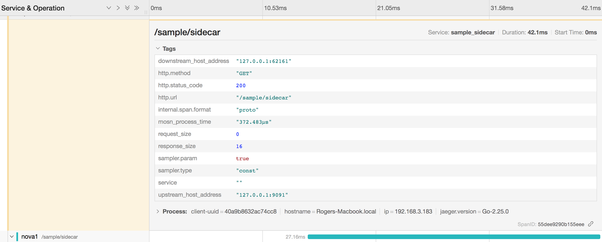

# 概述

为mosn加入jaeger trace的链路追踪功能。


# 项目结构
- mosn
  - pkg
    - trace
      - jaeger

# 启动

二开逻辑：
1、在项目启动时，我们需要把`jaeger`插件注册进mosn的trace driver中。因此在`mosn/pkg/trace/jaeger/driver.go`中注册driver

```go
const (
	JaegerDriverName = "jaeger"
)

func init() {
	trace.RegisterDriver(DriverName, NewJaegerImpl())
}

```

然后需要在mosn的启动文件中引入这个包`mosn/cmd/mosn/main/mosn.go`

```go
import (
    _ "mosn.io/mosn/pkg/trace/jaeger"
)
```

2、把关键数据inject入jaeger的span中

查看`mosn/pkg/trace/jaeger/span.go`文件，如果想要添加额外的数据，则可以修改下面的函数就可以

```go
//SetRequestInfo 把当前请求相关信息放入span中
func (s *Span) SetRequestInfo(reqinfo api.RequestInfo) {
	span := s.jaegerSpan
	span.SetTag("request_size", reqinfo.BytesReceived())
	span.SetTag("response_size", reqinfo.BytesSent())
	if reqinfo.UpstreamHost() != nil {
		span.SetTag("upstream_host_address", reqinfo.UpstreamHost().AddressString())
	}
	if reqinfo.DownstreamLocalAddress() != nil {
		span.SetTag("downstream_host_address", reqinfo.DownstreamRemoteAddress().String())
	}

	code := reqinfo.ResponseCode()
	span.SetTag("http.status_code", code)

	if isErrorResponse(code) {
		span.SetTag("error", true)
		span.SetTag("error.message", http.StatusText(code))
	}
	span.SetTag("mosn_process_time", reqinfo.ProcessTimeDuration().String())
}
```
jaeger管理后台截图


3、实际使用
然后我们在项目启动的配置文件中配置使用jaeger就可以了。例子如下：

```json
{
    "tracing": {
        "enable": true,                            //是否启动tracing功能
        "driver": "jaeger",                        //driver选择jaeger
        "config": {
            "service_name": "sample_sidecar",      //当前sidecar上报到jaeger的服务名称，建议【应用服务名_sidecar】,不设置则默认值为：default_sidecar
            "agent_host": "127.0.0.1:6831"       //当前jaeger agent的地址，不设置则默认值为：0.0.0.0:6831
        }
    },
}
```