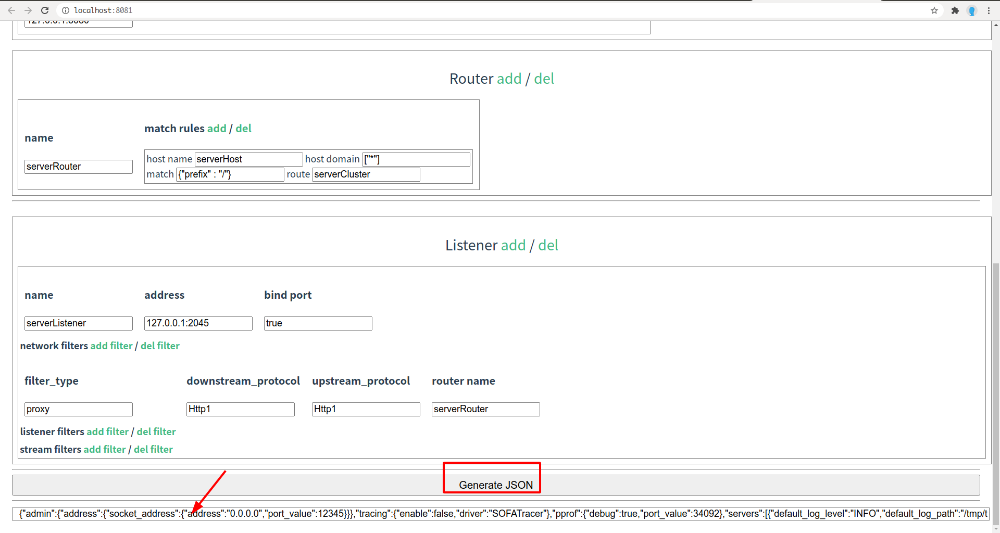

# v0.18.0

## 新增 MOSN 配置工具，提升用户配置体验

### 克隆 [mosn/configure](https://github.com/mosn/configure) 项目并安装依赖

```log
➜  mosn.io git:(master) ✗ cd ~/go/src/mosn.io && git clone https://github.com/mosn/configure.git && \
cd configure && npm install && npm run dev
```

### 自定义页面上的配置, 然后点击浏览器页面的 `Generate JSON` 按钮, 下方即生成 MOSN 的配置 json 内容



## 使用内存池减少了 TLS 连接的内存占用

### benchmark

```log
~/g/s/m/m/p/m/c/tls ❯❯❯ go test -run=none  -bench=ConnOutbufWithPool -benchmem -count=10 | tee new.txt
goos: darwin
goarch: amd64
pkg: mosn.io/mosn/pkg/mtls/crypto/tls
BenchmarkConnOutbufWithPool-8   	 2050006	       585 ns/op	    1285 B/op	       2 allocs/op
BenchmarkConnOutbufWithPool-8   	 1837488	       657 ns/op	    1285 B/op	       2 allocs/op
BenchmarkConnOutbufWithPool-8   	 2008862	       758 ns/op	    1285 B/op	       2 allocs/op
BenchmarkConnOutbufWithPool-8   	 1946272	       591 ns/op	    1286 B/op	       2 allocs/op
BenchmarkConnOutbufWithPool-8   	 2021349	       590 ns/op	    1286 B/op	       2 allocs/op
BenchmarkConnOutbufWithPool-8   	 1720242	       614 ns/op	    1286 B/op	       2 allocs/op
BenchmarkConnOutbufWithPool-8   	 2004352	       694 ns/op	    1286 B/op	       2 allocs/op
BenchmarkConnOutbufWithPool-8   	 2016597	       583 ns/op	    1286 B/op	       2 allocs/op
BenchmarkConnOutbufWithPool-8   	 2073991	       580 ns/op	    1286 B/op	       2 allocs/op
BenchmarkConnOutbufWithPool-8   	 2104670	       606 ns/op	    1286 B/op	       2 allocs/op
PASS
ok  	mosn.io/mosn/pkg/mtls/crypto/tls	18.689s


~/g/s/m/m/p/m/c/tls ❯❯❯ go test -run=none  -bench=ConnOutbufWithPool -benchmem -count=10 | tee old.txt
goos: darwin
goarch: amd64
pkg: mosn.io/mosn/pkg/mtls/crypto/tls
BenchmarkConnOutbufWithPool-8   	  647096	      1797 ns/op	   10629 B/op	       6 allocs/op
BenchmarkConnOutbufWithPool-8   	  652296	      1864 ns/op	   10629 B/op	       6 allocs/op
BenchmarkConnOutbufWithPool-8   	  641229	      1871 ns/op	   10629 B/op	       6 allocs/op
BenchmarkConnOutbufWithPool-8   	  643198	      1884 ns/op	   10629 B/op	       6 allocs/op
BenchmarkConnOutbufWithPool-8   	  647911	      1868 ns/op	   10629 B/op	       6 allocs/op
BenchmarkConnOutbufWithPool-8   	  633558	      1869 ns/op	   10629 B/op	       6 allocs/op
BenchmarkConnOutbufWithPool-8   	  644599	      1861 ns/op	   10629 B/op	       6 allocs/op
BenchmarkConnOutbufWithPool-8   	  651838	      1885 ns/op	   10629 B/op	       6 allocs/op
BenchmarkConnOutbufWithPool-8   	  652796	      1908 ns/op	   10629 B/op	       6 allocs/op
BenchmarkConnOutbufWithPool-8   	  632562	      1858 ns/op	   10629 B/op	       6 allocs/op
PASS
ok  	mosn.io/mosn/pkg/mtls/crypto/tls	13.485s


~/g/s/m/m/p/m/c/tls ❯❯❯ benchstat old.txt new.txt
name                  old time/op    new time/op    delta
ConnOutbufWithPool-8    1.87µs ± 2%    0.63µs ±21%  -66.61%  (p=0.000 n=9+10)

name                  old alloc/op   new alloc/op   delta
ConnOutbufWithPool-8    10.6kB ± 0%     1.3kB ± 0%  -87.90%  (p=0.000 n=10+10)

name                  old allocs/op  new allocs/op  delta
ConnOutbufWithPool-8      6.00 ± 0%      2.00 ± 0%  -66.67%  (p=0.000 n=10+10)

```

### Detail benchmark

[comment in issue](https://github.com/mosn/mosn/pull/1415#issuecomment-715183299)


## 修复 MOSNConfig.servers[].listeners[].bind_port 设置为 false 时热重启出错

### 启动 example 下的 8080 端口 HTTP 服务

```log
➜  http-sample git:(master) ✗ cd ~/go/src/mosn.io/mosn/examples/codes/http-sample && go run server.go

```

### mosn config

```json
{
	"close_graceful" : false,
	"servers":[
		{
			"default_log_path":"stdout",
			"default_log_level": "WARN",
			"routers":[
				{
					"router_config_name":"server_router",
					"virtual_hosts":[{
						"name":"serverHost",
						"domains": ["*"],
						"routers": [
							{
								"match":{"prefix":"/"},
								"route":{"cluster_name":"serverCluster"}
							}
						]
					}]
				}
			],
			"listeners":[
				{
					"name":"serverListener",
					"address": "127.0.0.1:2046",
					"bind_port": true,
					"filter_chains": [{
						"filters": [
							{
								"type": "proxy",
								"config": {
									"downstream_protocol": "Http1",
									"upstream_protocol": "Http1",
									"router_config_name":"server_router"
								}
							}
						]
					}]
				},
				{
					"name":"serverListener_no_bind",
					"address": "127.0.0.1:9090",
					"bind_port": false,
					"filter_chains": [{
						"filters": [
							{
								"type": "proxy",
								"config": {
									"downstream_protocol": "Http1",
									"upstream_protocol": "Http1",
									"router_config_name":"server_router"
								}
							}
						]
					}]
				}
			]
		}
	],
	"cluster_manager":{
		"clusters":[
			{
				"name":"serverCluster",
				"type": "SIMPLE",
				"lb_type": "LB_RANDOM",
				"max_request_per_conn": 1024,
				"conn_buffer_limit_bytes":32768,
				"hosts":[
					{"address":"127.0.0.1:8080"}
				]
			}
		]
	},
	"admin": {
		"address": {
			"socket_address": {
				"address": "0.0.0.0",
				"port_value": 34902
			}
		}
	}
}
```

### 旧 mosn 启动日志

```log
➜  main git:(master) ✗ cd ~/go/src/mosn.io/mosn/cmd/mosn/main && go build -mod=vendor -o mosn && ./mosn -config config.json
2020-11-02 19:53:57,585 [INFO] [router] [Extend] [RegisterRouterRule] order is 1
2020-11-02 19:53:57,585 [INFO] [router] [Extend] [RegisterHandlerChain] order is 1
2020-11-02 19:53:57,585 [INFO] [config] processor added to configParsedCBMaps
2020-11-02 19:53:57,599 [INFO] [network] [ register pool factory] register protocol: Http1 factory
2020-11-02 19:53:57,599 [INFO] [network] [ register pool factory] register protocol: Http2 factory
2020-11-02 19:53:57,599 [INFO] [network] [ register pool factory] register protocol: X factory
2020-11-02 19:53:57,601 [INFO] load config from :  config.json
2020-11-02 19:53:57,601 [INFO] [mosn] [start] xds service type must be sidecar or router
2020-11-02 19:53:57,601 [INFO] [mosn] [init tracing] disable tracing
2020-11-02 19:53:57,601 [INFO] [server] [reconfigure] not reconfigure: dial unix /home/trainyao/go/src/mosn.io/mosn/cmd/mosn/main/reconfig.sock: connect: no such file or directory
2020-11-02 19:53:57,601 [INFO] [mosn] [NewMosn] new mosn created
2020-11-02 19:53:57,602 [INFO] [cluster] [cluster manager] [AddOrUpdatePrimaryCluster] cluster serverCluster updated
2020-11-02 19:53:57,602 [INFO] [upstream] [host set] update host, final host total: 1
2020-11-02 19:53:57,602 [INFO] [cluster] [primaryCluster] [UpdateHosts] cluster serverCluster update hosts: 1
2020-11-02 19:53:57,602 [INFO] mosn start xds client
2020-11-02 19:53:57,602 [WARN] [feature gate] feature XdsMtlsEnable is not enabled
2020-11-02 19:53:57,602 [WARN] [feature gate] feature PayLoadLimitEnable is not enabled
2020-11-02 19:53:57,602 [WARN] [feature gate] feature MultiTenantMode is not enabled
2020-11-02 19:53:57,602 [WARN] [feature gate] feature auto_config is not enabled
2020-11-02 19:53:57,602 [INFO] mosn parse extend config
2020-11-02 19:53:57,602 [INFO] mosn prepare for start
2020-11-02 19:53:57,609 [ERROR] StaticResources is null
2020-11-02 19:53:57,609 [WARN] fail to init xds config, skip xds: null point exception
2020-11-02 19:53:57,609 [INFO] mosn start server
2020-11-02 19:53:57,609 [INFO] [admin store] [start service] start service Mosn Admin Server on [::]:34902
```

### 执行新 MOSN reload, 新 MOSN 可以正常重启

```log
➜  main git:(master) ✗ cd ~/go/src/mosn.io/mosn/cmd/mosn/main && ./mosn -config config.json
2020-11-02 19:58:03,751 [INFO] [router] [Extend] [RegisterRouterRule] order is 1
2020-11-02 19:58:03,751 [INFO] [router] [Extend] [RegisterHandlerChain] order is 1
2020-11-02 19:58:03,751 [INFO] [config] processor added to configParsedCBMaps
2020-11-02 19:58:03,763 [INFO] [network] [ register pool factory] register protocol: Http1 factory
2020-11-02 19:58:03,763 [INFO] [network] [ register pool factory] register protocol: Http2 factory2020-11-02 19:58:03,763 [INFO] [network] [ register pool factory] register protocol: X factory
2020-11-02 19:58:03,767 [INFO] load config from :  config.json
2020-11-02 19:58:03,768 [INFO] [mosn] [start] xds service type must be sidecar or router
2020-11-02 19:58:03,768 [INFO] [mosn] [init tracing] disable tracing
2020-11-02 19:58:03,768 [INFO] [server] Get InheritListeners start
2020-11-02 19:58:04,769 [INFO] [server] Get InheritListeners Accept
2020-11-02 19:58:04,769 [INFO] [mosn] [NewMosn] active reconfiguring
2020-11-02 19:58:04,769 [INFO] [admin store] [mosn state] state changed to 2
2020-11-02 19:58:04,769 [INFO] load config from :  /home/trainyao/go/src/mosn.io/mosn/cmd/mosn/main/config.json
2020-11-02 19:58:04,769 [INFO] [cluster] [cluster manager] [AddOrUpdatePrimaryCluster] cluster serverCluster updated
2020-11-02 19:58:04,769 [INFO] [upstream] [host set] update host, final host total: 1
2020-11-02 19:58:04,769 [INFO] [cluster] [primaryCluster] [UpdateHosts] cluster serverCluster update hosts: 1
2020-11-02 19:58:04,769 [INFO] [config] [parse listener] [tcp] inherit listener addr: 127.0.0.1:2046
2020-11-02 19:58:04,769 [INFO] mosn start xds client
2020-11-02 19:58:04,769 [WARN] [feature gate] feature auto_config is not enabled
2020-11-02 19:58:04,769 [WARN] [feature gate] feature XdsMtlsEnable is not enabled
2020-11-02 19:58:04,769 [WARN] [feature gate] feature PayLoadLimitEnable is not enabled
2020-11-02 19:58:04,769 [WARN] [feature gate] feature MultiTenantMode is not enabled
2020-11-02 19:58:04,769 [INFO] mosn parse extend config
2020-11-02 19:58:04,769 [INFO] mosn prepare for start
2020-11-02 19:58:04,769 [ERROR] StaticResources is null
2020-11-02 19:58:04,769 [WARN] fail to init xds config, skip xds: null point exception
2020-11-02 19:58:04,769 [INFO] [admin store] [start service] [inheritListener] inherit listener addr: [::]:34902
2020-11-02 19:58:04,769 [INFO] mosn start server
2020-11-02 19:58:04,769 [INFO] [admin store] [start service] start service Mosn Admin Server on [::]:34902

```

### 旧 MOSN 日志

```log
...
...
                                                                                                       
2020-11-02 19:58:04,769 [WARN] [admin store] [start service] start serve failed : Mosn Admin Server [::]:34902 http: Server closed
```

### client 日志, client 可以正常访问新 MOSN

```log
➜  main git:(master) ✗ curl localhost:2046 -v
* Rebuilt URL to: localhost:2046/
*   Trying 127.0.0.1...
* TCP_NODELAY set
* Connected to localhost (127.0.0.1) port 2046 (#0)
> GET / HTTP/1.1
> Host: localhost:2046
> User-Agent: curl/7.58.0
> Accept: */*
> 
< HTTP/1.1 200 OK
< Date: Mon, 02 Nov 2020 08:34:52 GMT
< Content-Type: text/plain
< Content-Length: 415
< 
Method: GET
Protocol: HTTP/1.1
Host: localhost:2046
RemoteAddr: 127.0.0.1:56968
RequestURI: "/"
URL: &url.URL{Scheme:"", Opaque:"", User:(*url.Userinfo)(nil), Host:"", Path:"/", RawPath:"", ForceQuery:false, RawQuery:"", Fragment:""}
Body.ContentLength: 0 (-1 means unknown)
Close: false (relevant for HTTP/1 only)
TLS: (*tls.ConnectionState)(nil)

Headers:
Accept: */*
Content-Length: 0
User-Agent: curl/7.58.0
* Connection #0 to host localhost left intact

```

## 修复 MOSN 接收 XDS 消息大于 4M 时的 `ResourceExhausted: grpc: received message larger than max` 错误

### log before

```log
2020-11-02 18:03:31,184 [INFO] mosn parse extend config
2020-11-02 18:03:31,184 [INFO] mosn prepare for start
2020-11-02 18:03:31,184 [INFO] mosn start server
2020-11-02 18:03:31,184 [INFO] [admin store] [start service] start service Mosn Admin Server on [::]:34901
2020-11-02 18:03:31,184 [INFO] [admin store] [start service] start service prometheus on [::]:15090
2020-11-02 18:03:31,184 [INFO] xds client start
2020-11-02 18:03:31,184 [INFO] [admin store] [add service] add server Mosn Admin Server
2020-11-02 18:03:31,184 [INFO] [admin store] [mosn state] state changed to 1
2020-11-02 18:03:31,185 [INFO] mosn estab grpc connection to pilot at 127.0.0.1:15010
2020-11-02 18:03:31,628 [INFO] [xds] [ads client] get resp error: rpc error: code = ResourceExhausted desc = grpc: received message larger than max (7459222 vs. 4194304), retry after 1s
2020-11-02 18:03:32,184 [INFO] [server] [reconfigure] reconfigureHandler start
2020-11-02 18:03:32,631 [INFO] [xds] [ads client] get resp error: rpc error: code = ResourceExhausted desc = grpc: received message larger than max (439496754 vs. 4194304), retry after 1s
2020-11-02 18:03:33,636 [INFO] [xds] [ads client] get resp error: rpc error: code = ResourceExhausted desc = grpc: received message larger than max (758198573 vs. 4194304), retry after 1s
2020-11-02 18:03:34,640 [INFO] [xds] [ads client] get resp error: rpc error: code = ResourceExhausted desc = grpc: received message larger than max (844378416 vs. 4194304), retry after 1s
2020-11-02 18:03:35,645 [INFO] [xds] [ads client] get resp error: rpc error: code = ResourceExhausted desc = grpc: received message larger than max (808466995 vs. 4194304), retry after 1s
2020-11-02 18:03:36,648 [INFO] [xds] [ads client] get resp error: rpc error: code = ResourceExhausted desc = grpc: received message larger than max (1513042737 vs. 4194304), retry after 1s
```

### log after

```log
2020-11-02 18:05:52,598 [INFO] mosn prepare for start
2020-11-02 18:05:52,599 [INFO] mosn start server
2020-11-02 18:05:52,599 [INFO] [admin store] [start service] start service prometheus on [::]:15090
2020-11-02 18:05:52,599 [INFO] [admin store] [start service] start service Mosn Admin Server on [::]:34901
2020-11-02 18:05:52,598 [INFO] xds client start
2020-11-02 18:05:52,598 [INFO] [admin store] [add service] add server Mosn Admin Server
2020-11-02 18:05:52,599 [INFO] [admin store] [mosn state] state changed to 1
2020-11-02 18:05:52,600 [INFO] mosn estab grpc connection to pilot at 127.0.0.1:15010
2020-11-02 18:05:53,599 [INFO] [server] [reconfigure] reconfigureHandler start
2020-11-02 18:05:54,176 [INFO] get 9945 clusters from CDS
2020-11-02 18:05:54,300 [INFO] [cluster] [cluster manager] [AddOrUpdatePrimaryCluster] cluster outbound|443||kubernetes.default.svc.cluster.local updated
2020-11-02 18:05:54,300 [INFO] [cluster] [cluster manager] [AddOrUpdatePrimaryCluster] cluster outbound|53||kube-dns.kube-system.svc.cluster.local updated
2020-11-02 18:05:54,300 [INFO] [cluster] [cluster manager] [AddOrUpdatePrimaryCluster] cluster outbound|443||hpa-metrics-service.kube-system.svc.cluster.local updated
2020-11-02 18:05:54,300 [INFO] [cluster] [cluster manager] [AddOrUpdatePrimaryCluster] cluster outbound|443||kube-user.default.svc.cluster.local updated
2020-11-02 18:05:54,300 [INFO] [cluster] [cluster manager] [AddOrUpdatePrimaryCluster] cluster outbound|10250||monitor-tcc-gz02-dev-prome-kubelet.kube-system.svc.cluster.local updated
2020-11-02 18:05:54,300 [INFO] [upstream] [host set] update host, final host total: 0
2020-11-02 18:05:54,300 [INFO] [cluster] [primaryCluster] [UpdateHosts] cluster outbound|10250||monitor-tcc-gz02-dev-prome-kubelet.kube-system.svc.cluster.local update hosts: 0
2020-11-02 18:05:54,300 [INFO] [cluster] [cluster manager] [AddOrUpdatePrimaryCluster] cluster outbound|10255||monitor-tcc-gz02-dev-prome-kubelet.kube-system.svc.cluster.local updated
2020-11-02 18:05:54,300 [INFO] [upstream] [host set] update host, final host total: 0
2020-11-02 18:05:54,300 [INFO] [cluster] [primaryCluster] [UpdateHosts] cluster outbound|10255||monitor-tcc-gz02-dev-prome-kubelet.kube-system.svc.cluster.local update hosts: 0
2020-11-02 18:05:54,300 [INFO] [cluster] [cluster manager] [AddOrUpdatePrimaryCluster] cluster outbound|4194||monitor-tcc-gz02-dev-prome-kubelet.kube-system.svc.cluster.local updated
2020-11-02 18:05:54,300 [INFO] [upstream] [host set] update host, final host total: 0
2020-11-02 18:05:54,300 [INFO] [cluster] [primaryCluster] [UpdateHosts] cluster outbound|4194||monitor-tcc-gz02-dev-prome-kubelet.kube-system.svc.cluster.local update hosts: 0
2020-11-02 18:05:54,300 [INFO] [cluster] [cluster manager] [AddOrUpdatePrimaryCluster] cluster outbound|80||amp-dba-dmall-com.dmall-inner.svc.cluster.local updated
2020-11-02 18:05:54,300 [INFO] [upstream] [host set] update host, final host total: 0
2020-11-02 18:05:54,300 [INFO] [cluster] [primaryCluster] [UpdateHosts] cluster outbound|80||amp-dba-dmall-com.dmall-inner.svc.cluster.local update hosts: 0
2020-11-02 18:05:54,300 [INFO] [cluster] [cluster manager] [AddOrUpdatePrimaryCluster] cluster outbound|80||amp-omp-dmall-com.dmall-inner.svc.cluster.local updated
2020-11-02 18:05:54,300 [INFO] [upstream] [host set] update host, final host total: 0
2020-11-02 18:05:54,300 [INFO] [cluster] [primaryCluster] [UpdateHosts] cluster outbound|80||amp-omp-dmall-com.dmall-inner.svc.cluster.local update hosts: 0
2020-11-02 18:05:54,300 [INFO] [cluster] [cluster manager] [AddOrUpdatePrimaryCluster] cluster outbound|80||amp-bsm-dmall-com.dmall-inner.svc.cluster.local updated
2020-11-02 18:05:54,300 [INFO] [upstream] [host set] update host, final host total: 0
2020-11-02 18:05:54,300 [INFO] [cluster] [primaryCluster] [UpdateHosts] cluster outbound|80||amp-bsm-dmall-com.dmall-inner.svc.cluster.local update hosts: 0
2020-11-02 18:05:54,300 [INFO] [cluster] [cluster manager] [AddOrUpdatePrimaryCluster] cluster outbound|80||amp-dmall-com.dmall-inner.svc.cluster.local updated
2020-11-02 18:05:54,300 [INFO] [upstream] [host set] update host, final host total: 0
2020-11-02 18:05:54,300 [INFO] [cluster] [primaryCluster] [UpdateHosts] cluster outbound|80||amp-dmall-com.dmall-inner.svc.cluster.local update hosts: 0
2020-11-02 18:05:54,301 [INFO] [cluster] [cluster manager] [AddOrUpdatePrimaryCluster] cluster outbound|80||amp-meta-dmall-com.dmall-inner.svc.cluster.local updated
2020-11-02 18:05:54,301 [INFO] [upstream] [host set] update host, final host total: 0
2020-11-02 18:05:54,301 [INFO] [cluster] [primaryCluster] [UpdateHosts] cluster outbound|80||amp-meta-dmall-com.dmall-inner.svc.cluster.local update hosts: 0
2020-11-02 18:05:54,301 [INFO] [cluster] [cluster manager] [AddOrUpdatePrimaryCluster] cluster outbound|80||coo-refund-system-api-dmall-com.dmall-inner.svc.cluster.local updated
```

## client 端 TLS handshake 失败时增加降级逻辑 & 修复 TLS 超时导致死循环 & 修改 TLS hashvalue 计算方式

### 执行 `test/case/run_all.sh`

```log
➜  cases git:(master) ✗ cd ~/go/src/mosn.io/mosn/test/cases && bash run_all.sh
build mosn binary
run test cases

...
...
...

=== RUN   TestDisableTLSAndUpdateHostTLS
2020-11-02 18:16:17,554 [INFO] [network] [ register pool factory] register protocol: X factory
2020-11-02 18:16:17,560 [INFO] [router] [Extend] [RegisterRouterRule] order is 1
2020-11-02 18:16:17,560 [INFO] [router] [Extend] [RegisterHandlerChain] order is 1
2020-11-02 18:16:17,560 [INFO] mosn is builded in debug mosn
2020-11-02 18:16:17,560 [INFO] [admin server] [register api] register a new api /debug/update_config
2020-11-02 18:16:17,560 [INFO] [admin server] [register api] register a new api /debug/disable_tls
2020-11-02 18:16:17,560 [INFO] [config] processor added to configParsedCBMaps
2020-11-02 18:16:17,563 [INFO] [network] [ register pool factory] register protocol: Http1 factory
2020-11-02 18:16:17,563 [INFO] [network] [ register pool factory] register protocol: Http2 factory
2020-11-02 18:16:17,563 [INFO] [network] [ register pool factory] register protocol: X factory
2020-11-02 18:16:17,565 [INFO] load config from :  /tmp/mosn_test_config.json
2020-11-02 18:16:17,566 [INFO] [mosn] [start] xds service type must be sidecar or router
2020-11-02 18:16:17,566 [ERROR] write pid file error: open /home/admin/mosn/logs/mosn.pid: no such file or directory
2020-11-02 18:16:17,566 [INFO] [mosn] [init tracing] disable tracing
2020-11-02 18:16:17,566 [INFO] [server] [reconfigure] not reconfigure: dial unix /home/admin/mosn/conf/reconfig.sock: connect: no such file or directory
2020-11-02 18:16:17,566 [INFO] [mosn] [NewMosn] new mosn created
2020-11-02 18:16:17,566 [INFO] [config] [parse cluster] max_request_per_conn is not specified, use default value 1024
2020-11-02 18:16:17,566 [INFO] [config] [parse cluster] conn_buffer_limit_bytes is not specified, use default value 16384
2020-11-02 18:16:17,566 [INFO] [config] [parse cluster] max_request_per_conn is not specified, use default value 1024
2020-11-02 18:16:17,566 [INFO] [config] [parse cluster] conn_buffer_limit_bytes is not specified, use default value 16384
2020-11-02 18:16:17,566 [INFO] [cluster] [cluster manager] [AddOrUpdatePrimaryCluster] cluster mosn_cluster updated
2020-11-02 18:16:17,566 [INFO] [cluster] [cluster manager] [AddOrUpdatePrimaryCluster] cluster server_cluster updated
2020-11-02 18:16:17,566 [INFO] [upstream] [host set] update host, final host total: 1
2020-11-02 18:16:17,566 [INFO] [cluster] [primaryCluster] [UpdateHosts] cluster mosn_cluster update hosts: 1
2020-11-02 18:16:17,566 [INFO] [upstream] [host set] update host, final host total: 1
2020-11-02 18:16:17,566 [INFO] [cluster] [primaryCluster] [UpdateHosts] cluster server_cluster update hosts: 1
2020-11-02 18:16:17,566 [INFO] parsing listen config:tcp
2020-11-02 18:16:17,566 [INFO] [server] [conn handler] [add listener] add listener: 127.0.0.1:2045
2020-11-02 18:16:17,566 [INFO] parsing listen config:tcp
2020-11-02 18:16:17,566 [INFO] [server] [conn handler] [add listener] add listener: 127.0.0.1:2046
2020-11-02 18:16:17,566 [INFO] [router] [virtualhost] [addRouteBase] add a new route rule
2020-11-02 18:16:17,566 [INFO] [router] [routers] [NewRouters] add route matcher default virtual host
2020-11-02 18:16:17,566 [INFO] [router] [routers_manager] [AddOrUpdateRouters] add router: router_to_mosn
2020-11-02 18:16:17,566 [INFO] [router] [virtualhost] [addRouteBase] add a new route rule
2020-11-02 18:16:17,566 [INFO] [router] [routers] [NewRouters] add route matcher default virtual host
2020-11-02 18:16:17,566 [INFO] [router] [routers_manager] [AddOrUpdateRouters] add router: router_to_server
2020-11-02 18:16:17,566 [INFO] mosn start xds client
2020-11-02 18:16:17,566 [WARN] [feature gate] feature XdsMtlsEnable is not enabled
2020-11-02 18:16:17,566 [WARN] [feature gate] feature PayLoadLimitEnable is not enabled
2020-11-02 18:16:17,566 [WARN] [feature gate] feature MultiTenantMode is not enabled
2020-11-02 18:16:17,566 [WARN] [feature gate] feature auto_config is not enabled
2020-11-02 18:16:17,566 [INFO] mosn parse extend config
2020-11-02 18:16:17,566 [INFO] mosn prepare for start
2020-11-02 18:16:17,567 [INFO] xds client start
2020-11-02 18:16:17,567 [INFO] [admin store] [add service] add server Mosn Admin Server
2020-11-02 18:16:17,567 [ERROR] StaticResources is null
2020-11-02 18:16:17,567 [WARN] fail to init xds config, skip xds: null point exception
2020-11-02 18:16:17,567 [INFO] mosn start server
2020-11-02 18:16:17,567 [INFO] [admin store] [start service] start service Mosn Admin Server on 127.0.0.1:34901
2020-11-02 18:16:17,567 [INFO] [admin store] [mosn state] state changed to 1
2020-11-02 18:16:18,567 [ERROR] [server] [reconfigure] reconfigureHandler net listen error: listen unix /home/admin/mosn/conf/reconfig.sock: bind: no such file or directory
2020-11-02 18:16:19,555 [INFO] remote addr: 127.0.0.1:2045, network: tcp
2020-11-02 18:16:19,556 [INFO] remote addr: 127.0.0.1:2046, network: tcp
2020-11-02 18:16:19,558 [INFO] remote addr: 127.0.0.1:8080, network: tcp
2020-11-02 18:16:19,561 [INFO] disable global tls
2020-11-02 18:16:19,563 [INFO] [admin api]  [stats dump] stats dump
2020-11-02 18:16:19,564 [INFO] [upstream] [host set] update host, final host total: 1
2020-11-02 18:16:19,564 [INFO] [cluster] [primaryCluster] [UpdateHosts] cluster mosn_cluster update hosts: 1
2020-11-02 18:16:19,564 [INFO] [cluster] [cluster manager] [AddOrUpdatePrimaryCluster] cluster mosn_cluster updated
2020-11-02 18:16:19,564 [INFO] [upstream] [host set] update host, final host total: 1
2020-11-02 18:16:19,564 [INFO] [cluster] [primaryCluster] [UpdateHosts] cluster mosn_cluster update hosts: 1
2020-11-02 18:16:19,564 [INFO] update cluster config success
2020-11-02 18:16:19,565 [INFO] [upstream] [cluster manager] 127.0.0.1:2046 tls state changed
2020-11-02 18:16:19,565 [INFO] [stream] [xprotocol] [keepalive] connection 3 stopped keepalive
2020-11-02 18:16:19,565 [INFO] remote addr: 127.0.0.1:2046, network: tcp
2020-11-02 18:16:19,568 [INFO] [admin api]  [stats dump] stats dump
2020-11-02 18:16:19,568 [INFO] enable global tls
2020-11-02 18:16:19,569 [INFO] [upstream] [cluster manager] 127.0.0.1:2046 tls state changed
2020-11-02 18:16:19,569 [INFO] remote addr: 127.0.0.1:2046, network: tcp
2020-11-02 18:16:19,569 [INFO] [stream] [xprotocol] [keepalive] connection 6 stopped keepalive
2020-11-02 18:16:19,582 [INFO] [admin api]  [stats dump] stats dump
2020-11-02 18:16:19,583 [INFO] disable global tls
2020-11-02 18:16:19,583 [INFO] [upstream] [cluster manager] 127.0.0.1:2046 tls state changed
2020-11-02 18:16:19,583 [INFO] remote addr: 127.0.0.1:2046, network: tcp
2020-11-02 18:16:19,583 [INFO] [stream] [xprotocol] [keepalive] connection 8 stopped keepalive
2020-11-02 18:16:19,587 [INFO] [admin api]  [stats dump] stats dump
2020-11-02 18:16:19,587 [INFO] [upstream] [host set] update host, final host total: 1
2020-11-02 18:16:19,587 [INFO] [cluster] [primaryCluster] [UpdateHosts] cluster mosn_cluster update hosts: 1
2020-11-02 18:16:19,587 [INFO] [cluster] [cluster manager] [AddOrUpdatePrimaryCluster] cluster mosn_cluster updated
2020-11-02 18:16:19,587 [INFO] [upstream] [host set] update host, final host total: 1
2020-11-02 18:16:19,588 [INFO] [cluster] [primaryCluster] [UpdateHosts] cluster mosn_cluster update hosts: 1
2020-11-02 18:16:19,588 [INFO] update cluster config success
2020-11-02 18:16:19,588 [INFO] [upstream] [cluster manager] 127.0.0.1:2046 tls state changed
2020-11-02 18:16:19,588 [INFO] [stream] [xprotocol] [keepalive] connection 10 stopped keepalive
2020-11-02 18:16:19,588 [INFO] remote addr: 127.0.0.1:2046, network: tcp
2020-11-02 18:16:19,591 [INFO] [admin api]  [stats dump] stats dump
2020-11-02 18:16:19,591 [INFO] enable global tls
2020-11-02 18:16:19,593 [INFO] [admin api]  [stats dump] stats dump
2020-11-02 18:16:19,594 [INFO] finish case
2020-11-02 18:16:19,597 [INFO] [network] [read loop] do read err: EOF
--- PASS: TestDisableTLSAndUpdateHostTLS (2.04s)
    framework.go:95: setup scenario: change tls states, connection pool changed 
    framework.go:97: run scenario: change tls states, connection pool changed 
    framework.go:30: run case: disable tls, no connection pool changed
    framework.go:32: finish case: disable tls, no connection pool changed
    framework.go:30: run case: update tls config when disabled, connection pool changed
    framework.go:32: finish case: update tls config when disabled, connection pool changed
    framework.go:30: run case: disable and update again
    framework.go:32: finish case: disable and update again

...
...
...

=== RUN   TestUpdateHostTLSConfig
2020-11-02 18:16:19,621 [INFO] [router] [Extend] [RegisterRouterRule] order is 1
2020-11-02 18:16:19,621 [INFO] [router] [Extend] [RegisterHandlerChain] order is 1
2020-11-02 18:16:19,623 [INFO] mosn is builded in debug mosn
2020-11-02 18:16:19,623 [INFO] [admin server] [register api] register a new api /debug/update_config
2020-11-02 18:16:19,623 [INFO] [admin server] [register api] register a new api /debug/disable_tls
2020-11-02 18:16:19,623 [INFO] [config] processor added to configParsedCBMaps
2020-11-02 18:16:19,635 [INFO] [network] [ register pool factory] register protocol: Http1 factory
2020-11-02 18:16:19,635 [INFO] [network] [ register pool factory] register protocol: Http2 factory
2020-11-02 18:16:19,635 [INFO] [network] [ register pool factory] register protocol: X factory
2020-11-02 18:16:19,645 [INFO] load config from :  /tmp/mosn_test_config.json
2020-11-02 18:16:19,647 [INFO] [mosn] [start] xds service type must be sidecar or router
2020-11-02 18:16:19,648 [ERROR] write pid file error: open /home/admin/mosn/logs/mosn.pid: no such file or directory
2020-11-02 18:16:19,648 [INFO] [mosn] [init tracing] disable tracing
2020-11-02 18:16:19,648 [INFO] [server] [reconfigure] not reconfigure: dial unix /home/admin/mosn/conf/reconfig.sock: connect: no such file or directory
2020-11-02 18:16:19,648 [INFO] [mosn] [NewMosn] new mosn created
2020-11-02 18:16:19,648 [INFO] [config] [parse cluster] max_request_per_conn is not specified, use default value 1024
2020-11-02 18:16:19,648 [INFO] [config] [parse cluster] conn_buffer_limit_bytes is not specified, use default value 16384
2020-11-02 18:16:19,648 [INFO] [config] [parse cluster] max_request_per_conn is not specified, use default value 1024
2020-11-02 18:16:19,648 [INFO] [config] [parse cluster] conn_buffer_limit_bytes is not specified, use default value 16384
2020-11-02 18:16:19,648 [INFO] [config] [parse cluster] max_request_per_conn is not specified, use default value 1024
2020-11-02 18:16:19,648 [INFO] [config] [parse cluster] conn_buffer_limit_bytes is not specified, use default value 16384
2020-11-02 18:16:19,648 [INFO] [cluster] [cluster manager] [AddOrUpdatePrimaryCluster] cluster mosn_cluster updated
2020-11-02 18:16:19,648 [INFO] [cluster] [cluster manager] [AddOrUpdatePrimaryCluster] cluster mosn_cluster_new updated
2020-11-02 18:16:19,648 [INFO] [cluster] [cluster manager] [AddOrUpdatePrimaryCluster] cluster server_cluster updated
2020-11-02 18:16:19,648 [INFO] [upstream] [host set] update host, final host total: 1
2020-11-02 18:16:19,648 [INFO] [cluster] [primaryCluster] [UpdateHosts] cluster mosn_cluster update hosts: 1
2020-11-02 18:16:19,649 [INFO] [upstream] [host set] update host, final host total: 1
2020-11-02 18:16:19,649 [INFO] [cluster] [primaryCluster] [UpdateHosts] cluster mosn_cluster_new update hosts: 1
2020-11-02 18:16:19,649 [INFO] [upstream] [host set] update host, final host total: 1
2020-11-02 18:16:19,649 [INFO] [cluster] [primaryCluster] [UpdateHosts] cluster server_cluster update hosts: 1
2020-11-02 18:16:19,649 [INFO] parsing listen config:tcp
2020-11-02 18:16:19,649 [INFO] [server] [conn handler] [add listener] add listener: 127.0.0.1:2045
2020-11-02 18:16:19,649 [INFO] parsing listen config:tcp
2020-11-02 18:16:19,650 [INFO] [server] [conn handler] [add listener] add listener: 127.0.0.1:2046
2020-11-02 18:16:19,650 [INFO] [router] [virtualhost] [addRouteBase] add a new route rule
2020-11-02 18:16:19,650 [INFO] [router] [routers] [NewRouters] add route matcher default virtual host
2020-11-02 18:16:19,650 [INFO] [router] [routers_manager] [AddOrUpdateRouters] add router: router_to_mosn
2020-11-02 18:16:19,650 [INFO] [router] [virtualhost] [addRouteBase] add a new route rule
2020-11-02 18:16:19,650 [INFO] [router] [routers] [NewRouters] add route matcher default virtual host
2020-11-02 18:16:19,650 [INFO] [router] [routers_manager] [AddOrUpdateRouters] add router: router_to_server
2020-11-02 18:16:19,650 [INFO] mosn start xds client
2020-11-02 18:16:19,650 [WARN] [feature gate] feature XdsMtlsEnable is not enabled
2020-11-02 18:16:19,650 [WARN] [feature gate] feature PayLoadLimitEnable is not enabled
2020-11-02 18:16:19,650 [WARN] [feature gate] feature MultiTenantMode is not enabled
2020-11-02 18:16:19,650 [WARN] [feature gate] feature auto_config is not enabled
2020-11-02 18:16:19,650 [INFO] mosn parse extend config
2020-11-02 18:16:19,650 [INFO] mosn prepare for start
2020-11-02 18:16:19,650 [INFO] xds client start
2020-11-02 18:16:19,650 [ERROR] StaticResources is null
2020-11-02 18:16:19,650 [WARN] fail to init xds config, skip xds: null point exception
2020-11-02 18:16:19,650 [INFO] [admin store] [add service] add server Mosn Admin Server
2020-11-02 18:16:19,651 [INFO] mosn start server
2020-11-02 18:16:19,651 [INFO] [admin store] [start service] start service Mosn Admin Server on 127.0.0.1:34901
2020-11-02 18:16:19,651 [INFO] [admin store] [mosn state] state changed to 1
2020-11-02 18:16:20,651 [ERROR] [server] [reconfigure] reconfigureHandler net listen error: listen unix /home/admin/mosn/conf/reconfig.sock: bind: no such file or directory
2020-11-02 18:16:21,598 [INFO] remote addr: 127.0.0.1:2045, network: tcp
2020-11-02 18:16:21,600 [INFO] remote addr: 127.0.0.1:2046, network: tcp
2020-11-02 18:16:21,611 [INFO] remote addr: 127.0.0.1:8080, network: tcp
2020-11-02 18:16:21,613 [INFO] [admin api]  [stats dump] stats dump
2020-11-02 18:16:21,613 [INFO] disable global tls
2020-11-02 18:16:21,613 [INFO] [upstream] [cluster manager] 127.0.0.1:2046 tls state changed
2020-11-02 18:16:21,613 [INFO] remote addr: 127.0.0.1:2046, network: tcp
2020-11-02 18:16:21,613 [INFO] [stream] [xprotocol] [keepalive] connection 3 stopped keepalive
2020-11-02 18:16:21,614 [ERROR] [mosn.common.tls_read_error] [mtls] tls connection read error: tls: first record does not look like a TLS handshake, local address: 127.0.0.1:2046, remote address: 127.0.0.1:51034
2020-11-02 18:16:21,614 [INFO] [network] [read loop] do read err: tls: handshake is not completed: tls: first record does not look like a TLS handshake
2020-11-02 18:16:21,614 [INFO] [network] [read loop] do read err: EOF
2020-11-02 18:16:21,614 [INFO] [stream] [xprotocol] [keepalive] connection 6 stopped keepalive
2020-11-02 18:16:21,614 [INFO] [2,-] [proxy] [downstream] processError=upstreamReset, proxyId: 3, reason: ConnectionTermination
2020-11-02 18:16:21,614 [INFO] [2,-] [proxy] [downstream] onUpstreamReset, send hijack, reason ConnectionTermination
2020-11-02 18:16:21,614 [WARN] [2,-] [proxy] [downstream] set hijack reply, proxyId = 3, code = 500, with headers = false
2020-11-02 18:16:21,614 [ERROR] status is not expected: 3, 0
2020-11-02 18:16:21,614 [INFO] [admin api]  [stats dump] stats dump
2020-11-02 18:16:21,615 [INFO] [router] [virtualhost] [addRouteBase] add a new route rule
2020-11-02 18:16:21,615 [INFO] [router] [routers] [NewRouters] add route matcher default virtual host
2020-11-02 18:16:21,615 [INFO] [router] [routers_manager] [AddOrUpdateRouters] update router: router_to_mosn
2020-11-02 18:16:21,615 [INFO] update router config success
2020-11-02 18:16:21,615 [INFO] [upstream] [cluster manager] 127.0.0.1:2046 tls state changed
2020-11-02 18:16:21,615 [INFO] remote addr: 127.0.0.1:2046, network: tcp
2020-11-02 18:16:21,616 [ERROR] [mosn.common.tls_read_error] [mtls] tls connection read error: tls: first record does not look like a TLS handshake, local address: 127.0.0.1:2046, remote address: 127.0.0.1:51038
2020-11-02 18:16:21,616 [INFO] [network] [read loop] do read err: tls: handshake is not completed: tls: first record does not look like a TLS handshake
2020-11-02 18:16:21,616 [INFO] [network] [read loop] do read err: EOF
2020-11-02 18:16:21,616 [INFO] [stream] [xprotocol] [keepalive] connection 8 stopped keepalive
2020-11-02 18:16:21,616 [INFO] [2,-] [proxy] [downstream] processError=upstreamReset, proxyId: 4, reason: ConnectionTermination
2020-11-02 18:16:21,616 [INFO] [2,-] [proxy] [downstream] onUpstreamReset, send hijack, reason ConnectionTermination
2020-11-02 18:16:21,616 [WARN] [2,-] [proxy] [downstream] set hijack reply, proxyId = 4, code = 500, with headers = false
2020-11-02 18:16:21,616 [ERROR] status is not expected: 3, 0
2020-11-02 18:16:21,616 [INFO] [admin api]  [stats dump] stats dump
2020-11-02 18:16:21,617 [INFO] enable global tls
2020-11-02 18:16:21,617 [INFO] remote addr: 127.0.0.1:2046, network: tcp
2020-11-02 18:16:21,618 [ERROR] [mosn.common.tls_read_error] [mtls] tls connection read error: tls: first record does not look like a TLS handshake, local address: 127.0.0.1:2046, remote address: 127.0.0.1:51042
2020-11-02 18:16:21,618 [INFO] [network] [read loop] do read err: tls: handshake is not completed: tls: first record does not look like a TLS handshake
2020-11-02 18:16:21,618 [INFO] [network] [read loop] do read err: EOF
2020-11-02 18:16:21,618 [INFO] [stream] [xprotocol] [keepalive] connection 10 stopped keepalive
2020-11-02 18:16:21,618 [INFO] [2,-] [proxy] [downstream] processError=upstreamReset, proxyId: 5, reason: ConnectionTermination
2020-11-02 18:16:21,618 [INFO] [2,-] [proxy] [downstream] onUpstreamReset, send hijack, reason ConnectionTermination
2020-11-02 18:16:21,618 [WARN] [2,-] [proxy] [downstream] set hijack reply, proxyId = 5, code = 500, with headers = false
2020-11-02 18:16:21,618 [ERROR] status is not expected: 3, 0
2020-11-02 18:16:21,618 [INFO] [admin api]  [stats dump] stats dump
--- PASS: TestUpdateHostTLSConfig (2.02s)
    framework.go:95: setup scenario: update host config to tls states 
    framework.go:97: run scenario: update host config to tls states 
    framework.go:30: run case: make tls connection
    framework.go:32: finish case: make tls connection
    framework.go:30: run case: disable global tls
    framework.go:32: finish case: disable global tls
    framework.go:30: run case: update router, route to another cluster which tls config is changed
    framework.go:32: finish case: update router, route to another cluster which tls config is changed
    framework.go:30: run case: enable global tls
    framework.go:32: finish case: enable global tls

...
...
...

=== RUN   TestServerNotSupportTLS
2020-11-02 18:16:21,618 [INFO] finish case
2020-11-02 18:16:21,619 [INFO] [network] [read loop] do read err: EOF
2020-11-02 18:16:21,626 [INFO] [router] [Extend] [RegisterRouterRule] order is 1
2020-11-02 18:16:21,626 [INFO] [router] [Extend] [RegisterHandlerChain] order is 1
2020-11-02 18:16:21,626 [INFO] mosn is builded in debug mosn
2020-11-02 18:16:21,626 [INFO] [admin server] [register api] register a new api /debug/update_config
2020-11-02 18:16:21,626 [INFO] [admin server] [register api] register a new api /debug/disable_tls
2020-11-02 18:16:21,626 [INFO] [config] processor added to configParsedCBMaps
2020-11-02 18:16:21,631 [INFO] [network] [ register pool factory] register protocol: Http1 factory
2020-11-02 18:16:21,631 [INFO] [network] [ register pool factory] register protocol: Http2 factory
2020-11-02 18:16:21,631 [INFO] [network] [ register pool factory] register protocol: X factory
2020-11-02 18:16:21,634 [INFO] load config from :  /tmp/mosn_test_config.json
2020-11-02 18:16:21,636 [INFO] [mosn] [start] xds service type must be sidecar or router
2020-11-02 18:16:21,636 [ERROR] write pid file error: open /home/admin/mosn/logs/mosn.pid: no such file or directory
2020-11-02 18:16:21,636 [INFO] [mosn] [init tracing] disable tracing
2020-11-02 18:16:21,636 [INFO] [server] [reconfigure] not reconfigure: dial unix /home/admin/mosn/conf/reconfig.sock: connect: no such file or directory
2020-11-02 18:16:21,636 [INFO] [mosn] [NewMosn] new mosn created
2020-11-02 18:16:21,636 [INFO] [config] [parse cluster] max_request_per_conn is not specified, use default value 1024
2020-11-02 18:16:21,636 [INFO] [config] [parse cluster] conn_buffer_limit_bytes is not specified, use default value 16384
2020-11-02 18:16:21,636 [INFO] [config] [parse cluster] max_request_per_conn is not specified, use default value 1024
2020-11-02 18:16:21,636 [INFO] [config] [parse cluster] conn_buffer_limit_bytes is not specified, use default value 16384
2020-11-02 18:16:21,636 [INFO] [config] [parse cluster] max_request_per_conn is not specified, use default value 1024
2020-11-02 18:16:21,636 [INFO] [config] [parse cluster] conn_buffer_limit_bytes is not specified, use default value 16384
2020-11-02 18:16:21,636 [INFO] [cluster] [cluster manager] [AddOrUpdatePrimaryCluster] cluster mosn_cluster updated
2020-11-02 18:16:21,636 [INFO] [cluster] [cluster manager] [AddOrUpdatePrimaryCluster] cluster mosn_cluster2 updated
2020-11-02 18:16:21,636 [INFO] [cluster] [cluster manager] [AddOrUpdatePrimaryCluster] cluster server_cluster updated
2020-11-02 18:16:21,636 [INFO] [upstream] [host set] update host, final host total: 1
2020-11-02 18:16:21,636 [INFO] [cluster] [primaryCluster] [UpdateHosts] cluster mosn_cluster update hosts: 1
2020-11-02 18:16:21,636 [INFO] [upstream] [host set] update host, final host total: 1
2020-11-02 18:16:21,636 [INFO] [cluster] [primaryCluster] [UpdateHosts] cluster mosn_cluster2 update hosts: 1
2020-11-02 18:16:21,636 [INFO] [upstream] [host set] update host, final host total: 1
2020-11-02 18:16:21,636 [INFO] [cluster] [primaryCluster] [UpdateHosts] cluster server_cluster update hosts: 1
2020-11-02 18:16:21,636 [INFO] parsing listen config:tcp
2020-11-02 18:16:21,636 [INFO] [server] [conn handler] [add listener] add listener: 127.0.0.1:2045
2020-11-02 18:16:21,637 [INFO] parsing listen config:tcp
2020-11-02 18:16:21,637 [INFO] [server] [conn handler] [add listener] add listener: 127.0.0.1:2046
2020-11-02 18:16:21,637 [INFO] parsing listen config:tcp
2020-11-02 18:16:21,637 [INFO] [server] [conn handler] [add listener] add listener: 127.0.0.1:2047
2020-11-02 18:16:21,637 [INFO] [router] [virtualhost] [addRouteBase] add a new route rule
2020-11-02 18:16:21,637 [INFO] [router] [virtualhost] [addRouteBase] add a new route rule
2020-11-02 18:16:21,637 [INFO] [router] [routers] [NewRouters] add route matcher default virtual host
2020-11-02 18:16:21,637 [INFO] [router] [routers_manager] [AddOrUpdateRouters] add router: router_to_mosn
2020-11-02 18:16:21,637 [INFO] [router] [virtualhost] [addRouteBase] add a new route rule
2020-11-02 18:16:21,637 [INFO] [router] [routers] [NewRouters] add route matcher default virtual host
2020-11-02 18:16:21,637 [INFO] [router] [routers_manager] [AddOrUpdateRouters] add router: router_to_server
2020-11-02 18:16:21,637 [INFO] mosn start xds client
2020-11-02 18:16:21,637 [WARN] [feature gate] feature XdsMtlsEnable is not enabled
2020-11-02 18:16:21,637 [WARN] [feature gate] feature PayLoadLimitEnable is not enabled
2020-11-02 18:16:21,637 [WARN] [feature gate] feature MultiTenantMode is not enabled
2020-11-02 18:16:21,637 [WARN] [feature gate] feature auto_config is not enabled
2020-11-02 18:16:21,637 [INFO] mosn parse extend config
2020-11-02 18:16:21,637 [INFO] mosn prepare for start
2020-11-02 18:16:21,637 [INFO] xds client start
2020-11-02 18:16:21,637 [ERROR] StaticResources is null
2020-11-02 18:16:21,637 [WARN] fail to init xds config, skip xds: null point exception
2020-11-02 18:16:21,637 [INFO] [admin store] [add service] add server Mosn Admin Server
2020-11-02 18:16:21,637 [INFO] mosn start server
2020-11-02 18:16:21,637 [INFO] [admin store] [start service] start service Mosn Admin Server on 127.0.0.1:34901
2020-11-02 18:16:21,637 [INFO] [admin store] [mosn state] state changed to 1
2020-11-02 18:16:22,637 [ERROR] [server] [reconfigure] reconfigureHandler net listen error: listen unix /home/admin/mosn/conf/reconfig.sock: bind: no such file or directory
2020-11-02 18:16:23,619 [INFO] remote addr: 127.0.0.1:2045, network: tcp
2020-11-02 18:16:23,620 [INFO] remote addr: 127.0.0.1:2046, network: tcp
2020-11-02 18:16:23,621 [ERROR] [4,-] [stream] [xprotocol] conn 4, 127.0.0.1:51050 decode error: Decode Error, type = unknown cmd type, value = 3, buf data: [22 3 1 0 186 1 0 0 182 3]
2020-11-02 18:16:23,621 [ERROR] [mosn.proxy.codec_error] [4,-] error occurs while proceeding codec logic: Decode Error, type = unknown cmd type, value = 3. close connection, remote addr: 127.0.0.1:51050
2020-11-02 18:16:23,621 [ERROR] [mosn.common.tls_fallback] tls handshake fallback, local addr 127.0.0.1:51050, remote addr 127.0.0.1:2046, error: read tcp 127.0.0.1:51050->127.0.0.1:2046: read: connection reset by peer
2020-11-02 18:16:23,632 [INFO] remote addr: 127.0.0.1:8080, network: tcp
2020-11-02 18:16:23,634 [INFO] remote addr: 127.0.0.1:2045, network: tcp
2020-11-02 18:16:23,635 [ERROR] [router] [sofa rotue rule] [failed match header: %v, value: %s] &{{1 1 1 1 1 1 -1 0 19 4  {[{[115 101 114 118 105 99 101] [116 101 115 116]}] false}} [1 1 0 1 1 0 0 0 1 1 255 255 255 255 0 0 0 19 0 0 0 4 0 0 0 7 115 101 114 118 105 99 101 0 0 0 4 116 101 115 116 110 117 108 108] [1 1 0 1 1 0 0 0 1 1 255 255 255 255 0 0 0 19 0 0 0 4] [] [0 0 0 7 115 101 114 118 105 99 101 0 0 0 4 116 101 115 116] [110 117 108 108]     ����         service   testnull null false}%!(EXTRA string=fallback)
2020-11-02 18:16:23,635 [INFO] remote addr: 127.0.0.1:2047, network: tcp
2020-11-02 18:16:23,636 [ERROR] [9,-] [stream] [xprotocol] conn 9, 127.0.0.1:49628 decode error: Decode Error, type = unknown cmd type, value = 3, buf data: [22 3 1 0 186 1 0 0 182 3]
2020-11-02 18:16:23,636 [ERROR] [mosn.proxy.codec_error] [9,-] error occurs while proceeding codec logic: Decode Error, type = unknown cmd type, value = 3. close connection, remote addr: 127.0.0.1:49628
2020-11-02 18:16:23,636 [INFO] [stream] [xprotocol] [keepalive] connection 8 stopped keepalive
2020-11-02 18:16:23,636 [INFO] remote addr: 127.0.0.1:2047, network: tcp
2020-11-02 18:16:23,637 [ERROR] [11,-] [stream] [xprotocol] conn 11, 127.0.0.1:49630 decode error: Decode Error, type = unknown cmd type, value = 3, buf data: [22 3 1 0 186 1 0 0 182 3]
2020-11-02 18:16:23,637 [ERROR] [mosn.proxy.codec_error] [11,-] error occurs while proceeding codec logic: Decode Error, type = unknown cmd type, value = 3. close connection, remote addr: 127.0.0.1:49630
2020-11-02 18:16:23,637 [INFO] [stream] [xprotocol] [keepalive] connection 10 stopped keepalive
2020-11-02 18:16:23,646 [INFO] remote addr: 127.0.0.1:2047, network: tcp
2020-11-02 18:16:23,647 [ERROR] [13,-] [stream] [xprotocol] conn 13, 127.0.0.1:49632 decode error: Decode Error, type = unknown cmd type, value = 3, buf data: [22 3 1 0 186 1 0 0 182 3]
2020-11-02 18:16:23,647 [ERROR] [mosn.proxy.codec_error] [13,-] error occurs while proceeding codec logic: Decode Error, type = unknown cmd type, value = 3. close connection, remote addr: 127.0.0.1:49632
2020-11-02 18:16:23,647 [INFO] [stream] [xprotocol] [keepalive] connection 12 stopped keepalive
2020-11-02 18:16:23,746 [INFO] remote addr: 127.0.0.1:2047, network: tcp
2020-11-02 18:16:23,747 [ERROR] [15,-] [stream] [xprotocol] conn 15, 127.0.0.1:49634 decode error: Decode Error, type = unknown cmd type, value = 3, buf data: [22 3 1 0 186 1 0 0 182 3]
2020-11-02 18:16:23,747 [ERROR] [mosn.proxy.codec_error] [15,-] error occurs while proceeding codec logic: Decode Error, type = unknown cmd type, value = 3. close connection, remote addr: 127.0.0.1:49634
2020-11-02 18:16:23,747 [INFO] [stream] [xprotocol] [keepalive] connection 14 stopped keepalive
2020-11-02 18:16:23,847 [INFO] remote addr: 127.0.0.1:2047, network: tcp
2020-11-02 18:16:23,847 [ERROR] [17,-] [stream] [xprotocol] conn 17, 127.0.0.1:49636 decode error: Decode Error, type = unknown cmd type, value = 3, buf data: [22 3 1 0 186 1 0 0 182 3]
2020-11-02 18:16:23,847 [ERROR] [mosn.proxy.codec_error] [17,-] error occurs while proceeding codec logic: Decode Error, type = unknown cmd type, value = 3. close connection, remote addr: 127.0.0.1:49636
2020-11-02 18:16:23,848 [INFO] [stream] [xprotocol] [keepalive] connection 16 stopped keepalive
2020-11-02 18:16:23,947 [INFO] remote addr: 127.0.0.1:2047, network: tcp
2020-11-02 18:16:23,948 [ERROR] [19,-] [stream] [xprotocol] conn 19, 127.0.0.1:49638 decode error: Decode Error, type = unknown cmd type, value = 3, buf data: [22 3 1 0 186 1 0 0 182 3]
2020-11-02 18:16:23,948 [ERROR] [mosn.proxy.codec_error] [19,-] error occurs while proceeding codec logic: Decode Error, type = unknown cmd type, value = 3. close connection, remote addr: 127.0.0.1:49638
2020-11-02 18:16:23,948 [INFO] [stream] [xprotocol] [keepalive] connection 18 stopped keepalive
2020-11-02 18:16:24,47 [INFO] remote addr: 127.0.0.1:2047, network: tcp
2020-11-02 18:16:24,48 [ERROR] [21,-] [stream] [xprotocol] conn 21, 127.0.0.1:49640 decode error: Decode Error, type = unknown cmd type, value = 3, buf data: [22 3 1 0 186 1 0 0 182 3]
2020-11-02 18:16:24,48 [ERROR] [mosn.proxy.codec_error] [21,-] error occurs while proceeding codec logic: Decode Error, type = unknown cmd type, value = 3. close connection, remote addr: 127.0.0.1:49640
2020-11-02 18:16:24,48 [INFO] [stream] [xprotocol] [keepalive] connection 20 stopped keepalive
2020-11-02 18:16:24,147 [ERROR] [upstream] [cluster manager] ConnPoolForCluster Failed; no health hosts
2020-11-02 18:16:24,147 [ERROR] [mosn.proxy.upstream_conn_failed] [7,-] initialize Upstream Connection Pool error, request can't be proxyed, error = [proxy] [downstream] no healthy upstream in cluster mosn_cluster2
2020-11-02 18:16:24,147 [WARN] [7,-] [proxy] [downstream] set hijack reply, proxyId = 3, code = 502, with headers = false
2020-11-02 18:16:24,147 [INFO] remote addr: 127.0.0.1:2047, network: tcp
2020-11-02 18:16:24,148 [INFO] finish case
--- PASS: TestServerNotSupportTLS (2.53s)
    framework.go:95: setup scenario: server side mosn not support tls, but client request with tls 
    framework.go:97: run scenario: server side mosn not support tls, but client request with tls 
    framework.go:30: run case: client request tls, trigger fallback
    framework.go:32: finish case: client request tls, trigger fallback
    framework.go:30: run case: client rquest tls, no fallback
    framework.go:32: finish case: client rquest tls, no fallback

...
...
...

PASS
ok  	mosn.io/mosn/test/cases	6.601s
all cases success
```


