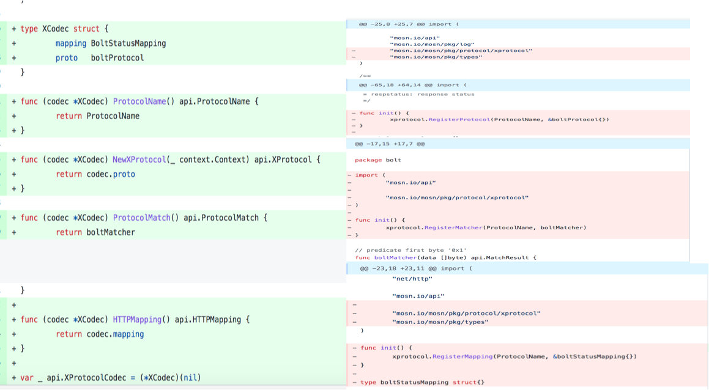
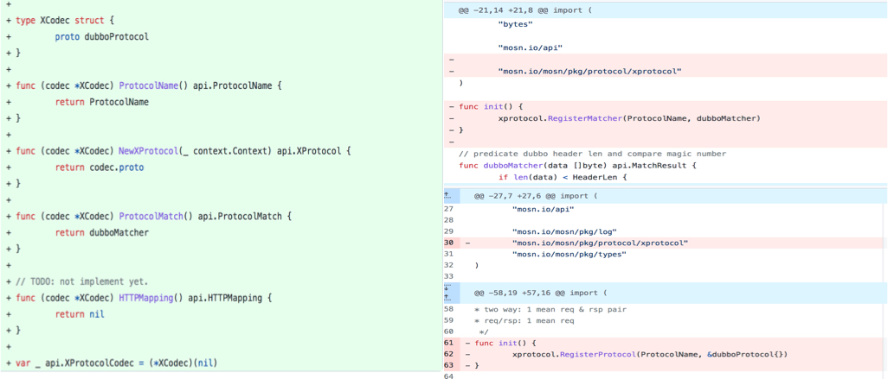
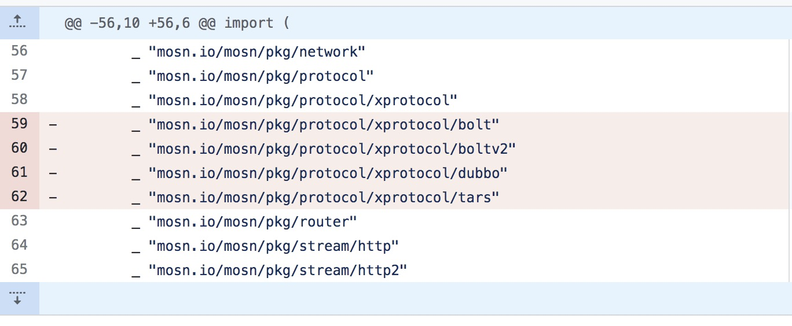
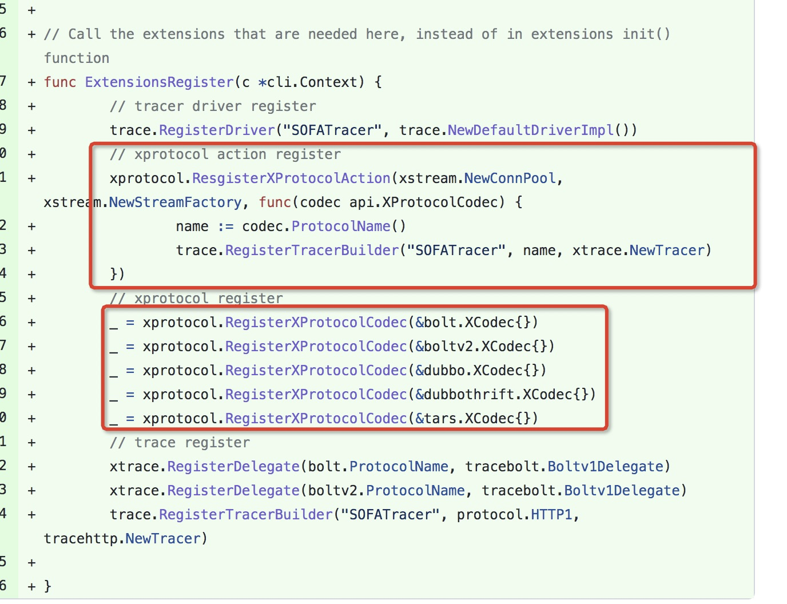

# XProtocol协议改造适配指南

## 背景

在MOSN v0.26.0中，相比之前(v0.25.0及以前)，对于协议与协议扩展进行了重构的调整，详细的改动见[#1874](https://github.com/mosn/mosn/pull/1874)，调整过后原有的协议扩展不能再直接应用于新版本(v0.26.0及以后），需要进行简单的适配的改造以后，才能继续使用。本文就是介绍如何对原有的协议扩展进行改造以适用于新版本的说明。
本次在编码适配上的改动主要涉及`XProtocol`协议实现以及`Trace`两个方面。

## 改动说明

### XProtocol 协议实现改动

+ 原来实现一个`XProtocol`协议可能分为三部分：`api.XProtocol`、`api.ProtocolMatch`、`api.HTTPMapping`，然后分别进行注册扩展，其中`ProtocolMatch`和`HTTPMapping`不是必须的；现在把这些全部收敛为`api.XProtocolCodec`，通过`XProtocolCodec`进行注册，如果不实现`ProtocolMatch`和`HTTPMapping`，则返回空即可。

+ 原来大部分协议注册`XProtocol`是一个单例，现在通过`XProtocolCodec`的`NewXProtocol`方法返回，可以仍然保持单例，也可以实现为每个连接一个的实例，对于部分特殊的、有状态的协议场景可以使用，大部分依然保持单例即可。

+ 原来的注册，都是扩展实现以后，通过`init()`方式，调用`Register`接口进行注册；但是这种方式并不太友好，而且也需要在`main`函数里通过`import _ "pkg"`加载，同时还使得扩展实现依赖了MOSN框架。在新版本中，我们去除了这种方式，改为通过在main函数里显式调用的方式进行注册，对于自定义扩展的场景，可以根据实际需求选择加载哪些协议，甚至可以重写一些MOSN“内置”的协议。
  +   需要注意的是在main里显示引用的方式是有顺序要求的

+ 为了解决一些循环依赖的问题，我们把为`XProtocol`提供了额外的扩展能力，通常情况下，`NewConnPool`和`StreamFactory`扩展不会变，但是需要显式注册一下。

### Trace 实现改动

在此先介绍一下MOSN的Trace框架：
首先，MOSN可以注册多个Trace的`Driver`，然后在运行时，基于配置，会选择一个`Driver`加载运行。不同的`Driver`通常是对接不同的输出格式，比如目前MOSN中的`SOFATracer`就是通过json日志的形式输出，另外还有`jeager`、`skywalking`等`Driver`，就是按照其对应格式的输出。目前`XProtocol`相关的Trace只实现了`SOFATracer`。

每个`Driver`，可以根据不同的协议，注册不同的`Tracer`实现，在MOSN处理请求的过程中，会根据配置加载的`Driver`、请求的协议，选择对应的`Tracer`，完成Trace相关的功能。

在新版本中，由于对XProtocol框架做了一些调整，协议的索引方式不再通过`X + SubProtocol`的方式，所以对于Trace部分也进行了调整：
+ 可以保持现状，使用一个通用的Trace实现，通过XProtocol的扩展能力注册
+ 也可以为每个协议实现自定义Trace实现
同样，需要将Trace的扩展注册也显式的在main函数下调用。

## 改动示例

### bolt 协议改动



### dubbo 协议改动

+ dubbo 协议没有实现`HTTPMapping`，因此直接返回`nil`



### main 改动

+ 删除原来的扩展引入方式



+ 在main下引入协议相关的扩展（红色框内）、Trace相关的扩展（不是每个协议都有）
  + MOSN后面会逐步淘汰init方式的扩展，全部改成类似的在main下显式引用的方式
  + 更多的细节请见[代码](https://github.com/mosn/mosn/blob/master/cmd/mosn/main/control.go#L228)
 


+ 目前没有单独实现Trace的`XProtocol`协议，如果有这种需求，需要在`RegisterXCodec`之后，调用`RegisterTracerBuilder`，伪代码如下:

```Go
func ExtensionsRegister(c *cli.Context) {
	... //

	_ = xprotocol.RegisterXProtocolCodec(&MyTraceProtocolCodec{})

	trace.RegisterTracerBuilder("SOFATracer", MyTraceProtocol, NewMyTraceProtocolTracer)
}
```
